# 🖥️ 머신러닝 프로젝트

### ⏬ 목차

#### 1. 데이터 분석 / RFM 분석

1-1. ZMG 지역의 성별에 따른 자전거 대여 서비스 이용률 차이가 나타난 원인은 무엇인가?  
1-2. RFM 분석

#### 2. 분류

2-1. 은행 고객 이탈 예측 (이진 분류)  
2-2. 비만 수준 예측 (다중 분류)  
2-3. 천체 유형 예측 (다중 분류)  
2-4. 흡연 여부 예측 (다중 분류)  
2-5. 용융 소자가 잠긴 액체의 종류 예측 (이중 분류)

#### 3. 회귀

3-1. 학생 시험 점수 회귀 예측  
3-2. 콘크리트 강도 회귀 예측  
3-3. 가전제품 에너지 사용량 회귀 예측

---

## 2. 분류

### 2-5. 용융 소자가 잠긴 액체의 종류 예측 (이중 분류)

#### 📚 Features

-   col1 ~ col10: 각 용융 소자가 측정한 전기 강도  
    \*강도 = ( |측정 전압 - 기본 전압| / 기본 전압 ) x 100, 기본 전압은 공기 중에서 측정한 전극의 전압을 나타냄

#### 🎈 Target

-   target: 물(1)/기름(-1)을 나타내는 정답 라벨

---

#### 📌 목차

1. 데이터 탐색 및 전처리
2. SMOTE를 통한 오버샘플링 진행
3. LDA를 통한 차원 축소 진행
4. Classifier 모델들을 사용한 분류 예측
5. 교차 검증을 통한 과적합 여부 확인
6. Threshold(임계값)에 따른 정밀도와 재현율 시각화
7. 정밀도와 재현율에 대한 분석

#### 1. 데이터 탐색 및 전처리

-   결측치가 존재하지 않았으며, 약 3137개의 중복행을 삭제했습니다.
-   데이터의 분포를 히스토그램으로 확인해보았습니다.

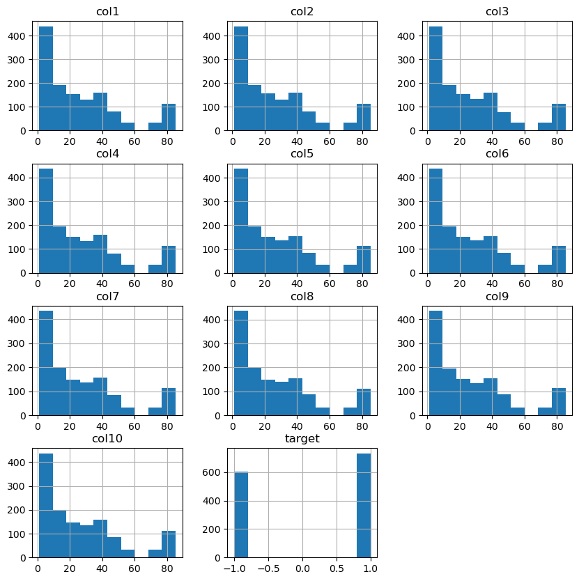

-   종속변수의 분포를 조정하기에 앞서, 각 독립변수의 분포를 보았을 때 대체로 동일한 양상을 띠어  
    `describe()`를 통해 수치로 확인해보았습니다.

-   모든 독립변수의 평균이나 표준편차 및 4분위 값이 완전히 동일한 값을 취하지는 않지만,  
    대체로 매우 비슷한 분포를 보이고 있습니다.
-   따라서 LDA를 통한 차원 축소를 진행하여도 무방하다고 판단하였습니다.
-   종속변수의 값이 -1과 1로 구성되어 있어 편의를 위해 0과 1로 레이블인코딩을 진행하였습니다.
-   기름이 0, 물이 1로 인코딩되었습니다.

#### 2. SMOTE를 통한 오버샘플링 진행

-   차원 축소를 진행하기에 앞서, 종속변수의 분포 비중을 맞추기 위해 SMOTE를 통한 오버샘플링을 진행했습니다.

#### 3. LDA를 통한 차원 축소 진행

-   종속 변수가 2개의 값 중 하나를 가지는 이진 분류에 해당하므로, 1차원으로 축소합니다.
-   10개의 feature를 1차원으로 축소하였음에도 불구하고, `explained_variance_ratio_`는 1.0이 나왔습니다.

#### 4. Classifier 모델들을 사용한 분류 예측

-   사용한 Classifier 모델들은 아래와 같습니다.
-   DecisionTreeClassifier(DTC)
-   SupportVector machine Classifier(SVC)
-   K-Nearest Neighbors classifier(KNN)
-   Ensemble(Hard/soft Voting[DTC, SVC, KNN])
-   Ensemble(Bagging[RandomForestClassifier(RFC)])
-   Ensemble(Boosting[AdaBoost, GradientBoosting machine Classifier(GBC), eXtra Gradient Boosting classifier(XGB), Light GradientBoostingMachine classifier(LGBM)])
-   위 모델들에 대해 GridSearchCV를 통해 최적의 하이퍼파라미터 탐색을 동시에 진행하였습니다.
-   LogisticRegression
-   각 모델별 평가 지표를 시각화한 그래프는 아래와 같았습니다.

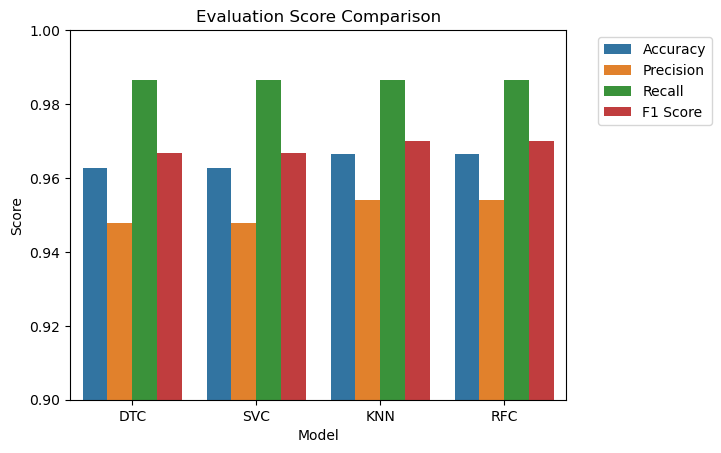

-   각 모델별 평가 지표를 백분율로 나타낸 결과는 아래와 같습니다.

          DTC의 정확도: 96.2687%, 정밀도: 94.7712%, 재현율: 98.6395%, F1 Score: 96.6667%
          SVC의 정확도: 96.2687%, 정밀도: 94.7712%, 재현율: 98.6395%, F1 Score: 96.6667%
          KNN의 정확도: 96.6418%, 정밀도: 95.3947%, 재현율: 98.6395%, F1 Score: 96.99%
          RFC의 정확도: 96.6418%, 정밀도: 95.3947%, 재현율: 98.6395%, F1 Score: 96.99%
          Hard Voting의 정확도: 96.6418%, 정밀도: 95.3947%, 재현율: 98.6395%, F1 Score: 96.99%
          Soft Voting의 정확도: 96.6418%, 정밀도: 95.3947%, 재현율: 98.6395%, F1 Score: 96.99%
          AdaBoost의 정확도: 97.3881%, 정밀도: 95.4545%, 재현율: 100.0%, F1 Score: 97.6744%
          GBC의 정확도: 95.8955%, 정밀도: 93.5897%, 재현율: 99.3197%, F1 Score: 96.3696%
          XGBoost의 정확도: 96.2687%, 정밀도: 94.7712%, 재현율: 98.6395%, F1 Score: 96.6667%
          LightGBM의 정확도: 97.0149%, 정밀도: 95.4248%, 재현율: 99.3197%, F1 Score: 97.3333%
          LogisticRegression의 정확도: 97.3881%, 정밀도: 96.6667%, 재현율: 98.6395%, F1 Score: 97.6431%

-   F1 Score가 가장 높은 AdaBoost 모델과 LogisticRegression 모델 중, AdaBoost의 경우  
    재현율(Recall)이 1.0으로 과적합의 우려가 더 강하므로, LogisticRegression 모델이 가장 적합하다고 판단하였습니다.

#### 6. 교차 검증을 통한 과적합 여부 확인

-   `cross_val_score()`을 통해 훈련 데이터에서의 교차 검증 시 정확도와,  
    실제 테스트 데이터에 대한 예측 정확도를 비교해보았습니다.
-   교차 검증 시 평균 정확도는 약 0.9633, 테스트 데이터에 대한 정확도는 약 0.9739로 나타났습니다.
-   실제 예측 시의 정확도가 좀 더 높았으므로, 훈련 데이터에 대한 과적합은 발생하지 않았다고 판단됩니다.

#### 7. Threshold(임계치)에 따른 정밀도와 재현율 시각화

-   정밀도(precision)와 재현율(recall)의 trade-off를 시각화하였습니다.

-   threshold value가 약 0.6일 때를 기준으로 정밀도와 재현율이 서로 교차하고 있음을 알 수 있습니다.
-   이때의 ROC Curve 또한 시각화하였습니다.

-   ROC-AUC 값이 약 0.9725로 1에 매우 가깝기 때문에, ROC Curve 아래의 영역 또한 가로 1, 세로 1의  
    직사각형에 가까운 모습을 볼 수 있습니다.

#### 8. 정밀도와 재현율에 대한 분석

-   현재 주어진 이진 분류 상황에서 TP, FP, TN, FN과 정밀도 및 재현율이 나타내는 개념은 아래와 같습니다(0: 기름, 1: 물).
-   TP: 모델이 물에 잠긴 상황을 물에 잠긴 상황으로 올바르게 분류한 경우.
-   FP: 모델이 기름에 잠긴 상황을 물에 잠긴 상황으로 잘못 분류한 경우(오진, error I).
-   TN: 모델이 기름에 잠긴 상황을 기름에 잠긴 상황으로 올바르게 분류한 경우.
-   FN: 모델이 물에 잠긴 상황을 기름에 잠긴 상황으로 잘못 분류한 경우(놓침, error II).

-   정밀도 (Precision): 모델이 물에 잠긴 상황으로 예측한 상황 중에서 실제로 물에 잠긴 상황의 비율을 나타냅니다. 즉, 양성 클래스로 예측한 결과 중 얼마나 많은 것이 진짜 양성인지 측정합니다.
-   재현율 (Recall): 실제로 물에 잠긴 상황 중에서 모델이 물에 잠긴 상황으로 정확하게 예측한 상황의 비율을 나타냅니다. 즉, 모델이 얼마나 많은 물에 잠긴 상황을 "놓치지 않고" 감지했는지 측정합니다.

---

-   물과 기름 모두 전기가 자유롭게 흐르지 않지만, 전기적으로 비전도성인 물과 기름 간에는 차이가 있습니다. 일반적으로 물은 전기적으로 더 좋은 전도체로 간주됩니다. 물은 이온을 가지고 있으며 이온이 전기를 전달하는 데에 중요한 역할을 하기 때문입니다. 그러나 기름은 전기적으로 전도성이 낮습니다. 기름은 이온을 가지고 있지 않거나 매우 적기 때문에 전기를 전달하는 데에 물보다는 훨씬 더 낮은 능력을 가지고 있습니다.

-   따라서 전기 회로에서 물과 기름이 상호 작용할 때, 물은 전기를 더 잘 전달할 수 있으며, 이에 따라 더 많은 전기적 문제가 발생할 수 있습니다.
-   반면에 기름은 전기적으로 전도성이 낮기 때문에 전기 회로와의 상호 작용이 물보다는 덜할 수 있습니다.

-   이러한 이유로 물에 잠긴 상황이 전기 회로에 더 큰 위험을 가져올 수 있으므로, error II의 피해가 error I의 피해보다 크다는 결론을 내릴 수 있습니다.
-   즉, FN을 낮추기 위해 재현율을 높여야 합니다.
-   앞선 Logistic Regression 모델의 성능 평가 결과는 아래와 같았습니다.

**[정확도: 0.9739, 정밀도: 0.9667, 재현율: 0.9864, F1: 0.9764, ROC-AUC: 0.9725]**

-   앞서 임계치에 따른 정밀도와 재현율을 시각화한 그래프에서 볼 수 있듯이,  
    재현율을 높이기 위해 임계치를 낮출 경우 재현율의 상승폭보다 정밀도의 하락폭이 더 크며,  
     이미 재현율은 약 0.9864로 준수한 성능을 보이기 때문에 임계치 조정은 필요 없을 것으로 판단됩니다.

---

## 3. 회귀

### 3-1. 학생 시험 점수 회귀 예측

#### 📚 Features

-   Hours Studied: 공부 시간
-   Previous Scores: 이전 시험에서 취득한 점수
-   Extracurricular Activities: 방과후 학습 참여 여부
-   Sleep Hours: 평균 수면 시간
-   Sample Question Papers Practiced: 학생이 공부한 연습문제지 개수

#### 🎈 Target

-   Performance Index: 시험 점수

---

#### 📌 목차

1. 데이터 탐색 및 전처리
2. 선형 회귀 분석
3. OLS, VIF 확인
4. 교차 검증 및 Pytorch를 통한 loss 변화 비교
5. 일반화를 위해 Lasso(L1), Ridge(L2)를 통한 규제 적용

#### 1. 데이터 탐색 및 전처리

-   결측치가 존재하지 않았으며, 약 127개의 중복행을 삭제하였습니다.
-   범주형 feature인 'Extracurricular Activities' feature를 제외하였습니다.
-   독립변수와 종속변수를 포함하여 상관관계를 히트맵으로 시각화한 결과는 아래와 같았습니다.

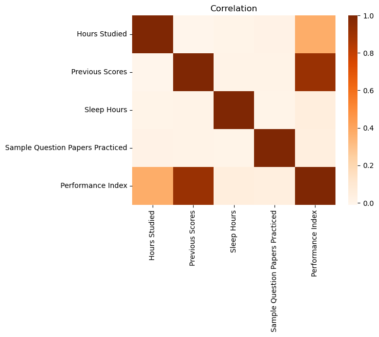

-   독립변수 사이의 상관관계는 0에 가까운 양상을 띠었습니다.

#### 2. 선형 회귀 분석

-   scikit-learn의 LinearRegression 모델을 사용하여 선형 회귀 예측을 수행한 결과 아래와 같았습니다.
-   `MSE: 4.1479, RMSE: 2.0367, MSLE: 0.0021, RMSLE: 0.0461, R2: 0.9885`
-   선형 회귀 분석 결과 R2는 약 0.9885로 매우 높게 나타났으므로,  
    해당 데이터는 선형 데이터의 형태를 띤다고 볼 수 있습니다.
-   R2 값을 보았을 때 과적합되었을 가능성이 있다고 판단하여 추가적인 분석을 진행했습니다.

#### 3. OLS, VIF 확인

-   OLS 상에서 확인하였을 때, R2는 약 0.990으로 실제 회귀 예측 시와 비슷했습니다.
-   p-value 또한 모든 독립변수에서 0.000의 값을 보였으며, Durbin-Watson 점수 또한 1.918로 매우 높았습니다.
-   VIF를 확인해보았을 때 각 독립변수의 vif_score는 아래와 같았습니다.

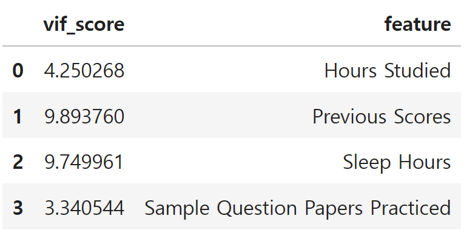

-   OLS 및 VIF에서 큰 문제가 없다고 판단하여 다른 방식으로 과적합 여부를 판단하기로 했습니다.

#### 4. 교차 검증 및 Pytorch를 통한 loss 변화 비교

-   앞서 OLS와 VIF에서 문제가 없었으므로, 이번에는 교차 검증을 통해 과적합 여부를 판단합니다.
-   `cross_val_score()`를 통해 훈련 데이터에 대한 교차 검증을 진행하였을 때,  
    평균 R2는 약 0.9884로 테스트 데이터에 대한 실제 회귀 예측 시의 R2인 0.9885와 비슷했습니다.
-   따라서 과적합이 발생하지 않았다고 예상되지만, 좀 더 정확한 판단을 위해 직접 검증 데이터를 나누어  
    Pytorch를 통해 loss를 시각화해보았습니다.

-   훈련 데이터를 다시 `train_test_split()`을 통해 훈련 데이터와 검증 데이터로 나눈 후,  
    각 데이터에 대해 각각 1,000,000번의 epoch를 반복하며 loss의 변화를 기록하였습니다.
-   500,000 epoch부터 loss의 변화가 거의 없어 그래프에는 500,000 epoch까지의 loss를 시각화하였습니다.
-   가중치와 편향은 각각 `torch.zeros()`를 통해 0으로 초기화한 후 SGD 경사하강법으로 학습을 진행하였고, 학습률(learning_rate)은 0.00019로 진행하였습니다.
-   기록 결과 훈련 데이터와 검증 데이터의 loss 변화 그래프가 매우 비슷한 양상을 띰으로써,  
    과적합이 발생하지 않았음을 알 수 있습니다.

#### 5. 일반화를 위해 Lasso(L1), Ridge(L2)를 통한 규제 적용

-   LinearRegression 모델로 회귀 예측을 진행했을 때, 학습 데이터와 테스트 데이터에 대한 예측값과 실제 정답을 시각화한 결과는 아래와 같았습니다.

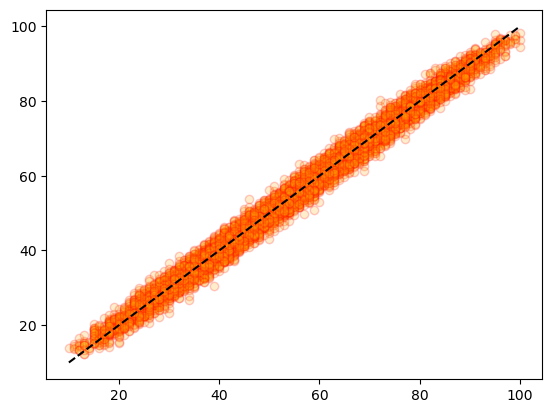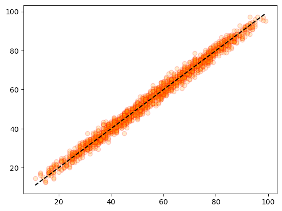

-   과적합은 발생하지 않았다고 판단되지만, 모델의 일반화를 위해 테스트 데이터에서의 R2를 약 0.95 수준으로 낮추기 위한 규제를 적용했습니다.
-   Lasso에서 alpha=9, max_iter=10000으로 설정 후 규제를 적용하였을 때 약 0.9510,  
    Ridge에서 alpha=50000, max_iter=10000으로 설정 후 규제를 적용하였을 때 약 0.9509의 R2를 나타냈습니다.
-   학습 데이터와 테스트 데이터에 대한 각 규제 적용 후의 예측값과 실제 정답을 시각화한 결과는 아래와 같았습니다.

📌 Lasso 규제 적용 결과 (왼쪽: 학습 데이터, 오른쪽: 테스트 데이터)

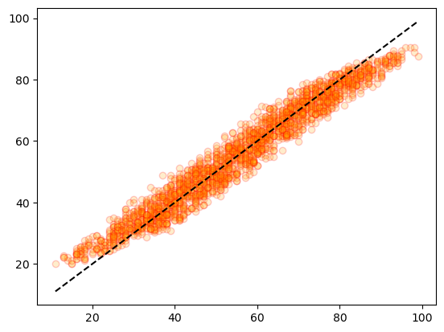

📌 Ridge 규제 적용 결과 (왼쪽: 학습 데이터, 오른쪽: 테스트 데이터)

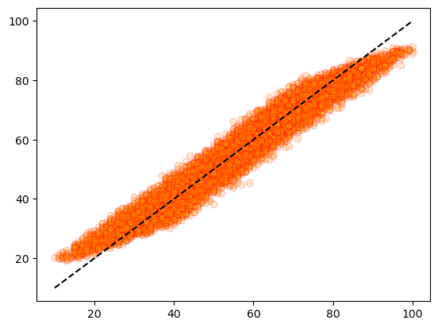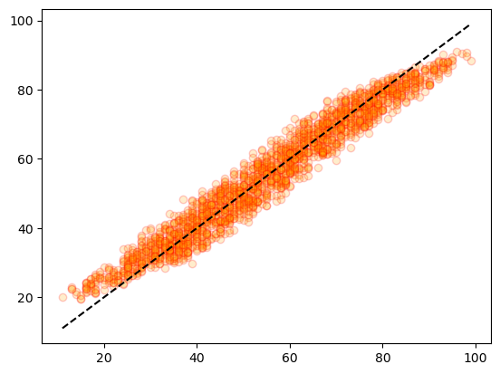

---

### 3-2. 콘크리트 강도 회귀 예측

#### 📚 Features

-   cement: 시멘트(kg/m3)
-   slag: 광재(kg/m3)
-   ash: 비산회(시멘트 혼합제, kg/m3)
-   water: 물(kg/m3)
-   superplastic: 유동화제(kg/m3)
-   coarseagg: 굵은 골재(kg/m3)
-   fineagg: 잔골재(kg/m3)
-   age: 콘크리트가 형성된 후 경과한 시간(1~365)

#### 🎈 Target

-   strength: 콘크리트의 압축강도

---

#### 📌 목차

1. 데이터 탐색 및 전처리
2. 선형 회귀 분석
3. 다항 회귀 분석
4. 트리 기반 회귀 모델을 사용한 회귀 분석
5. OLS, VIF 확인
6. 과적합 확인을 위한 교차 검증 및 예측값/실제 정답 비교

#### 1. 데이터 탐색 및 전처리

-   결측치가 존재하지 않았으며, 약 25개의 중복행을 삭제하였습니다.
-   독립변수와 종속변수를 포함하여 상관관계를 히트맵으로 시각화한 결과는 아래와 같았습니다.

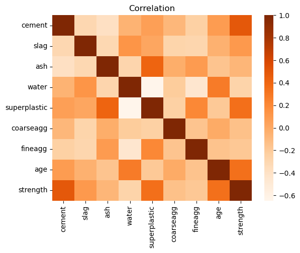

-   독립변수 사이의 상관관계가 0.5 이상인 독립변수는 존재하지 않았습니다.
-   종속변수와의 상관관계가 어느 정도 나타나는 cement, superplastic, age 등의 상관관계 수치를 확인해봅니다.
-   종속변수와의 상관관계를 내림차순으로 출력한 결과는 아래와 같습니다.

          cement          0.488283
          superplastic    0.344209
          age             0.337367
          slag            0.103374
          ash            -0.080648
          coarseagg      -0.144717
          fineagg        -0.186448
          water          -0.269624

#### 2. 선형 회귀 분석

-   기초적인 전처리만 진행한 상태에서, scikit-learn의 LinearRegression 모델을 통해 선형 회귀 예측을 진행한 결과 평가 지표 점수는 아래와 같았습니다.
-   `MSE: 100.9549, RMSE: 10.0476, MSLE: 0.1098, RMSLE: 0.3314, R2: 0.5974`
-   R2가 약 0.5974로, 해당 수치만으로 데이터의 선형성/비선형성을 판단하기엔 무리가 있지만,  
    다항 회귀 예측 및 트리 기반 회귀 모델을 사용한 비선형 회귀 예측을 진행하여  
    R2를 비교해보고자 했습니다.

#### 3. 다항(Polynomial) 회귀 분석

-   다항 회귀의 경우, `PolynomialFeatures()`의 하이퍼파라미터인 degree를 2차로 설정했을 때  
    R2가 약 0.7714로 가장 높았습니다(degree=3일 경우 약 0.7640으로 감소).
-   `MSE: 57.3214, RMSE: 7.5711, MSLE: 0.0582, RMSLE: 0.2413, R2: 0.7714`
-   따라서 선형 회귀 모델인 LinearRegression 모델을 사용하면서도,  
    비선형 관계를 모델링하는 방법인 다항 회귀를 사용하여 변수들을 다항식으로 변환한 후  
    사용함으로써 비선형성을 적용하였을 때 R2가 약 0.2 가량 유의미하게 상승하였으므로,  
    해당 데이터를 비선형 데이터로 간주하는 것에 무리가 없음을 확인하였습니다.

#### 4. 트리 기반 회귀 모델을 사용한 회귀 분석

-   해당 데이터의 비선형성을 앞서 확인하였으므로, 트리 기반 모델을 사용하여 회귀 분석을 진행합니다.
-   사용한 트리 기반 모델은 아래와 같습니다:

    1. DecisionTreeRegressor
    2. RandomForestRegressor
    3. GradientBoostingRegressor
    4. XGBRegressor
    5. LGBMRegressor

-   각 모델별 RMSE(루트 평균 제곱 오차)와 R2는 아래와 같습니다.

    1. DecisionTreeRegressor - RMSE: 6.0435, R2: 0.8544
    2. RandomForestRegressor - RMSE: 5.0128, R2: 0.8998
    3. GradientBoostingRegressor - RMSE: 5.3812, R2: 0.8845
    4. XGBRegressor - RMSE: 4.2289, R2: 0.9287
    5. LGBMRegressor - RMSE: 4.4983, R2: 0.9193

-   이 중 XGBRegressor(XGBoost) 모델이 RMSE와 R2 기준 가장 좋은 성능을 보였으므로,  
    해당 모델을 사용하여 GridSearchCV를 통해 최적의 하이퍼파라미터를 찾고자 했습니다.
-   각 하이퍼파라미터 조합에 대해 KFold를 통해 무작위로 10번의 교차 검증을 수행한 결과는 아래와 같았습니다.

-   GridSearchCV의 `cv_results_`를 통해 확인해본 결과,  
    `max_depth`가 작을 수록, 그리고 대체로 `n_estimators=100`일 때 R2가 높았습니다.
-   `best_estimator_`로 테스트 데이터에 대한 회귀 예측을 진행한 결과는 아래와 같았습니다.
-   `MSE: 17.3164, RMSE: 4.1613, MSLE: 0.0232, RMSLE: 0.1523, R2: 0.9309`
-   과적합 여부 등을 판단하기 위해 OLS 및 VIF를 확인해봅니다.

#### 5. OLS 및 VIF 확인

-   OLS 결과, R2는 약 0.930, Durbin-Watson은 약 1.862로 문제 없이 나타났습니다.
-   또한 각 독립변수의 p-value는 모두 0.003 이하로 나타났습니다.
-   VIF를 통해 다중공선성을 확인한 결과는 아래와 같았습니다.

-   water, coarseagg, fineagg의 VIF가 높아 종속변수와의 상관관계를 확인해본 결과,
    각각 약 -0.26, -0.14, -0.18로 낮게 나타나 삭제한 후 다시 OLS와 VIF를 확인하였습니다.
-   OLS 상에서 R2는 약 0.920, Durbin-Watson은 약 1.864로 나타났으며, VIF는 아래와 같았습니다.

-   모든 feature의 VIF 수치가 3 미만으로, 다중공선성 문제가 해결되었습니다.
-   다시 XGBRegressor 모델로 회귀 예측을 수행한 결과는 아래와 같았습니다.
-   `MSE: 18.8915, RMSE: 4.3464, MSLE: 0.0214, RMSLE: 0.1462, R2: 0.9247`
-   3개의 feature를 제거하기 전의 R2는 약 0.9309, 제거 후에는 약 0.9247로 나타났으며,  
    제거 전의 RMSE는 약 4.1613, 제거 후에는 약 4.3464로 나타났습니다.
-   높은 다중공선성을 보이던 3개의 feature를 제거한 후 R2는 약 0.006 감소하였지만,  
    여전히 높은 수치를 보이고 있다는 점에서 오히려 더 높은 신뢰도를 가진 회귀 모델로 판단됩니다.

#### 6. 과적합 확인을 위한 교차 검증 및 예측값/실제 정답 비교

-   `cross_val_score()`을 통한 교차 검증 결과 평균 R2는 약 0.8924,  
    실제 예측 결과 R2는 약 0.9247로 교차 검증 시에는 큰 문제가 발견되지 않았습니다.
-   학습 데이터와 테스트 데이터에 대한 모델의 예측값과 실제 정답의 분포를 시각화한 결과는 아래와 같습니다.

<code>MSE: 1.8634, RMSE: 1.3651, MSLE: 0.0022, RMSLE: 0.0469, R2: 0.9931(학습 데이터)  
MSE: 18.8915, RMSE: 4.3464, MSLE: 0.0214, RMSLE: 0.1462, R2: 0.9247(테스트 데이터)</code>

-   테스트 데이터의 R2가 낮으므로, 과적합 발생을 의심해볼 수 있었습니다.
-   따라서 `best_estimator_`가 아닌, GridSearchCV에서 R2 기준 12위를 기록한 하이퍼파라미터  
    조합으로 모델을 생성하여 학습 및 예측을 수행한 후, 같은 방식으로 시각화하였습니다.

<code>MSE: 1.6297, RMSE: 1.2766, MSLE: 0.0018, RMSLE: 0.0424, R2: 0.9939(학습 데이터)  
MSE: 30.3917, RMSE: 5.5129, MSLE: 0.0365, RMSLE: 0.1911, R2: 0.8788(테스트 데이터)</code>

-   테스트 데이터의 R2가 더 낮아짐에 따라, 이전의 모델에서 과적합이 발생했다고 보기 어렵다는  
    결론을 이끌어낼 수 있었습니다.
-   따라서 `XGBRegressor(max_depth=4, n_estimators=500, random_state=124) 모델이 가장 적합한  
    성능을 보였다고 볼 수 있습니다.

---

### 3-3. 가전제품 에너지 사용량 회귀 예측

> 저에너지(low-energy) 건물 내에서 ZigBee 무선 센서 네트워크로 수집된 데이터와,  
>  Chievres 기상 관측소에서 수집된 데이터를 결합한 데이터 세트입니다.

#### 📚 Features

-   date: 측정 날짜 및 시간
-   lights: 조명 장치의 전기 에너지 사용량
-   T1: 부엌의 온도
-   RH_1: 부엌의 습도
-   T2: 거실의 온도
-   RH_2: 거실의 습도
-   T3: 세탁실의 온도
-   RH_3: 세탁실의 습도
-   T4: 사무실의 온도
-   RH_4: 사무실의 습도
-   T5: 욕실의 온도
-   RH_5: 욕실의 습도
-   T6: 건물 밖(북쪽)의 온도
-   RH_6: 건물 밖(북쪽)의 습도
-   T7: 다리미방의 온도
-   RH_7: 다리미방의 습도
-   T8: 자녀 방의 온도
-   RH_8: 자녀 방의 습도
-   T9: 부모님 방(안방)의 온도
-   RH_9: 부모님 방(안방)의 습도
-   T_out: 바깥(Chievres weather station)의 온도
-   Press_mm_hg: 바깥(Chievres weather station)의 대기압
-   RH_out: 바깥(Chievres weather station)의 습도
-   Windspeed: 바깥(Chievres weather station)의 풍속
-   Visibility: 바깥(Chievres weather station)의 가시거리
-   Tdewpoint: 바깥(Chievres weather station)의 이슬점 온도
-   rv1: 랜덤한 변량 1
-   rv2: 랜덤한 변량 2

#### 🎈 Target

-   Appliances: 에너지 사용량 (Wh)

---

#### 📌 목차

_🎈Cycle 1_

1. 데이터 탐색 및 전처리
2. PCA를 통한 차원 축소
3. 선형 회귀 분석
4. 트리 기반 회귀 모델을 사용한 회귀 분석

_🎈Cycle 2_

1. OLS, VIF 확인 및 데이터 전처리
2. PCA를 통한 차원 축소
3. 선형 회귀 분석
4. 트리 기반 회귀 모델을 사용한 회귀 분석

_🎈Cycle 3_

1. feature별 분포 확인 및 전처리
2. 선형 회귀 분석
3. lights feature에 언더샘플링 적용
4. 언더샘플링 이후 선형 회귀 분석
5. 언더샘플링 이후 트리 기반 모델을 사용한 회귀 분석

_🎈Cycle 4_

1. 데이터 전처리
2. 선형 회귀 분석
3. 트리 기반 모델을 사용한 회귀 분석
4. GridSearchCV, RandomForestRegressor 모델을 사용한 회귀 분석

**_📌Cycle 1 ~ Cycle 4, R2 및 MSE Loss 값 비교_**

#### _🎈Cycle 1_

#### 1. 데이터 탐색 및 전처리

-   결측치와 중복행 모두 존재하지 않았습니다.
-   히스토그램으로 분포를 확인해본 결과, 종속변수의 분포가 좌측으로 치우쳐 나타났습니다.
-   좌측은 원본 종속변수의 분포, 우측은 log1p 스케일링을 적용한 종속변수의 분포입니다.

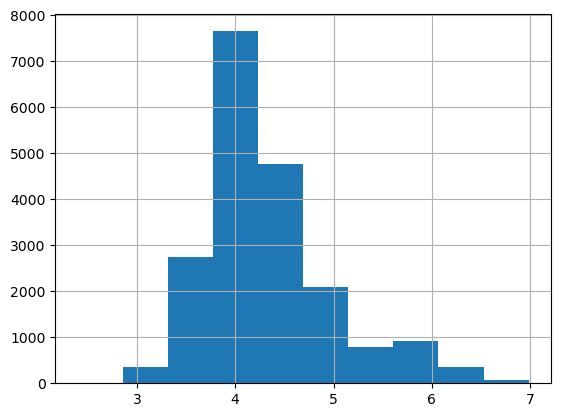

-   따라서 종속변수에 log1p 스케일링을 적용했습니다.
-   또한 회귀 예측에 불필요하다고 판단하여 date feature를 삭제했습니다.
-   아래는 나머지 독립변수들과 종속변수의 상관관계를 히트맵으로 시각화한 자료입니다.

-   독립변수 간의 상관관계가 대체로 크게 나타났습니다.
-   또한, 종속변수와의 상관관계가 높은 feature를 확인하기 어려워 수치로 확인해보았습니다.

-   종속변수와의 상관관계 절댓값이 0.3을 넘는 독립변수가 존재하지 않았습니다.
-   feature의 개수 또한 date 삭제 후에도 총 27개이므로, 차원 축소를 진행해야 한다고 판단했습니다.
-   PCA를 통한 차원 축소를 진행하여 독립 변수 간의 상관관계로 인해 나타날 수 있는 다중 공선성 문제를 해결하고,  
    계산의 효율성을 높이고자 하였습니다.
-   차원 축소를 진행하기 전 StandardScaler()를 통해 표준화를 진행하여 이상치를 제거했습니다.

#### 2. PCA를 통한 차원 축소

-   이상치를 제거한 데이터를 바탕으로 먼저 2차원으로 축소해보았습니다.
-   `explained_variance_ratio_`를 통해 축소된 2개의 feature가 원본 feature를 얼마나 잘 표현하는지 보았을 때, 약 0.77로 준수한 표현력을 보였습니다.

#### 3. 선형 회귀 분석

-   파이프라인을 구축하여, 표준화 진행 후 PCA를 통해 2차원으로 축소하여 선형 회귀 예측을 수행했습니다.
-   회귀 모델은 scikit-learn의 LinearRegression 모델을 사용했습니다.
-   회귀 예측 결과 평가 지표는 아래와 같이 나타났습니다.
-   `MSE: 0.3862, RMSE: 0.6214, MSLE: 0.0123, RMSLE: 0.1110, R2: 0.0159`
-   매우 낮은 예측 성능을 보였으므로, 트리 기반 회귀 모델로 다시 한 번 회귀 분석을 진행했습니다.

#### 4. 트리 기반 회귀 모델을 사용한 회귀 분석

-   마찬가지로 파이프라인을 구축하여 표준화 및 차원 축소를 진행한 후 모델 학습을 진행했습니다.
-   사용한 모델은 아래와 같습니다:

    -   DecisionTreeRegressor
    -   RandomForestRegressor
    -   GradientBoostingRegressor
    -   XGBRegressor
    -   LGBMRegressor

-   이때 각 모델의 예측 결과 평가 지표는 아래와 같이 나타났습니다.

<code>DecisionTreeRegressor  
MSE: 0.5292, RMSE: 0.7275, MSLE: 0.0168, RMSLE: 0.1295, R2: -0.3486  
RandomForestRegressor  
MSE: 0.3138, RMSE: 0.5602, MSLE: 0.0100, RMSLE: 0.1000, R2: 0.2004  
GradientBoostingRegressor  
MSE: 0.3629, RMSE: 0.6024, MSLE: 0.0115, RMSLE: 0.1074, R2: 0.0751  
XGBRegressor  
MSE: 0.3193, RMSE: 0.5651, MSLE: 0.0103, RMSLE: 0.1013, R2: 0.1862  
LGBMRegressor  
MSE: 0.3266, RMSE: 0.5715, MSLE: 0.0104, RMSLE: 0.1018, R2: 0.1677</code>

-   이 중에서 가장 높은 R2와 가장 낮은 RMSE를 보인 RandomForestRegressor 모델 또한,  
    R2가 약 0.2004로 매우 낮았습니다.
-   따라서 Cycle 2로 넘어가 다시 전처리를 수행합니다.

#### 🎈Cycle 2

#### 1. OLS, VIF 확인 및 데이터 전처리

-   OLS 확인 결과 p-value가 높은 feature들이 존재했습니다.
-   해당 feature들은 T1, T4, RH_4, T_out, RH_out, Visibility, rv1, rv2 였습니다.
-   이 중에서 삭제할 feature를 결정하기 위해 VIF를 통한 다중 공선성과,  
    종속변수와의 상관관계를 확인해보았습니다.
-   앞선 feature들의 VIF 점수는 각각 약 4245.8, 1202.9, 1445.7, 1006.4, 3844.2, 16.9, inf, inf였습니다.
-   또한 종속변수와의 상관관계는 각각 약 0.16, 0.13, -0.006, 0.17, -0.22, -0.01, -0.01, -0.01이었습니다.
-   따라서 가장 상관관계가 낮은 T1, T4, RH_4, Visibility, rv1, rv2 를 삭제했습니다.
-   이후 OLS를 확인한 결과, 여전히 T_out과 RH_out의 p-value가 너무 크게 나타나, 해당 feature들 또한 삭제했습니다.
-   VIF 상에서 전체적으로 감소하였으나, 여전히 높은 feature들이 존재하여 다중 공선성이 우려되었지만  
    OLS 상에서 보았을 때 p-value가 0.05 이상인 feature가 모두 사라졌으므로  
    PCA를 통한 차원 축소를 진행하여 회귀 예측 결과를 다시 살펴보고자 했습니다.

#### 2. PCA를 통한 차원 축소

-   2차원으로 축소한 후 `explained_variance_ratio_`는 약 0.8849로, 이전의 값(약 0.77)보다  
    값이 많이 증가하였음을 알 수 있습니다.

#### 3. 선형 회귀 분석

-   Cycle 1과 동일한 방식으로 파이프라인을 구축하여 표준화 및 차원 축소, 선형 회귀 분석을 진행합니다.
-   `MSE: 0.3555, RMSE: 0.5962, MSLE: 0.0113, RMSLE: 0.1063, R2: 0.0941`
-   3차원으로 축소하였을 때의 R2는 2차원이나 4차원, 혹은 다른 차원으로 축소했을 시보다  
    높았지만, 여전히 약 0.0941로 매우 낮았습니다.
-   따라서 다시 한 번 트리 기반 회귀 모델로 회귀 분석을 진행했습니다.

#### 4. 트리 기반 회귀 모델을 사용한 회귀 분석

-   Cycle 1과 동일한 모델을 사용하여 회귀 분석을 진행한 결과, 각 모델별 평가 지표는 아래와 같이 나타났습니다.

<code>DecisionTreeRegressor  
MSE: 0.4461, RMSE: 0.6679, MSLE: 0.0139, RMSLE: 0.1179, R2: -0.1368  
RandomForestRegressor  
MSE: 0.2348, RMSE: 0.4845, MSLE: 0.0074, RMSLE: 0.0860, R2: 0.4018  
GradientBoostingRegressor  
MSE: 0.3266, RMSE: 0.5715, MSLE: 0.0103, RMSLE: 0.1017, R2: 0.1677  
XGBRegressor  
MSE: 0.2694, RMSE: 0.5190, MSLE: 0.0086, RMSLE: 0.0925, R2: 0.3135  
LGBMRegressor  
MSE: 0.2797, RMSE: 0.5288, MSLE: 0.0089, RMSLE: 0.0942, R2: 0.2873</code>

-   Cycle 2 결과, RandomForestRegressor에서 R2가 약 0.4018로 많이 상승하였습니다.
-   Cycle 3으로 넘어가 각 feature들의 분포를 좀 더 조절하는 방향으로 진행해보겠습니다.

#### 🎈Cycle 3

#### 1. feature별 분포 확인 및 전처리

-   lights feature의 분포를 확인한 결과 아래와 같았습니다.

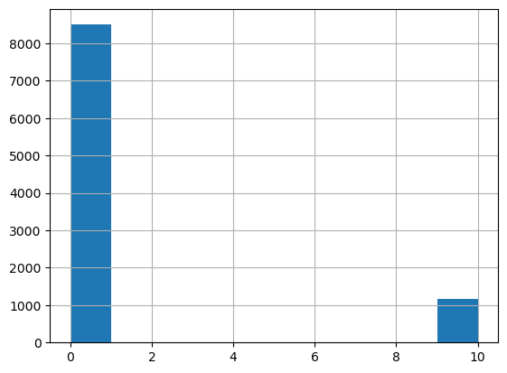

-   `value_counts()`를 통해 분포 비중을 수치로 확인해봅니다.

          lights
          0     8502
          10    1177

-   언더샘플링하기에는 비중 차이가 너무 크다고 판단하여, 삭제 여부를 결정하기 위해 종속변수와의 상관관계를 확인해보았습니다.
-   lights의 종속변수와의 상관관계는 약 0.18로, 삭제해도 무방하다고 판단하였습니다.
-   하지만 전체적으로 모든 feature의 종속변수와의 상관관계가 낮으므로,  
    lights 삭제 시 회귀 예측 정확도가 오히려 떨어질 수 있기 때문에 삭제 후의 결과를 확인한 후 다시 결정하고자 합니다.

#### 2. 선형 회귀 분석

-   lights 를 삭제한 후 앞선 Cycle과 동일한 방식으로 파이프라인을 구축하여 선형 회귀 예측을 진행합니다.
-   `MSE: 0.3595, RMSE: 0.5996, MSLE: 0.0114, RMSLE: 0.1069, R2: 0.0838`
-   lights를 삭제하기 전 선형 회귀 분석 결과 R2는 약 0.0941로, 삭제 후의 성능이 더 감소하였음을 알 수 있습니다.
-   따라서 lights를 삭제하기보다는, 언더샘플링을 통해 비중을 맞춰준 후 회귀 예측을 진행하는 것이 낫다고 판단하였습니다.

#### 3. lights feature에 언더샘플링 적용

-   lights feature에 0 값을 가진 행 중에서 10 값을 가진 행의 개수(1177개)만큼 언더샘플링합니다.

#### 4. 언더샘플링 이후 선형 회귀 분석

-   언더샘플링한 범주형 feature인 lights를 분리한 후 차원 축소를 진행합니다.
-   축소 후 다시 lights feature를 결합하여 회귀 분석을 진행합니다.
-   `MSE: 0.3085, RMSE: 0.5554, MSLE: 0.0097, RMSLE: 0.0986, R2: 0.1451`
-   언더샘플링 이후 PCA는 4차원으로 축소하였을 때 R2가 약 0.1451로 가장 높았으며,  
    이전 Cycle보다 상승한 모습을 보였습니다.
-   트리 기반 모델을 사용하여 다시 회귀 분석을 수행합니다.

#### 5. 언더샘플링 이후 트리 기반 모델을 사용한 회귀 분석

-   앞선 Cycle에서와 동일한 트리 기반 모델을 사용합니다.
-   각 모델별 회귀 분석 결과 평가 지표는 아래와 같았습니다.

<code>DecisionTreeRegressor  
MSE: 0.7535, RMSE: 0.8680, MSLE: 0.0235, RMSLE: 0.1534, R2: -1.0882  
RandomForestRegressor  
MSE: 0.3475, RMSE: 0.5895, MSLE: 0.0111, RMSLE: 0.1052, R2: 0.0369  
GradientBoostingRegressor  
MSE: 0.3236, RMSE: 0.5688, MSLE: 0.0103, RMSLE: 0.1016, R2: 0.1032  
XGBRegressor  
MSE: 0.4100, RMSE: 0.6403, MSLE: 0.0131, RMSLE: 0.1143, R2: -0.1362  
LGBMRegressor  
MSE: 0.3451, RMSE: 0.5874, MSLE: 0.0110, RMSLE: 0.1047, R2: 0.0436</code>

-   분포가 맞지 않는 feature인 lights를 대상으로 언더샘플링을 진행하였음에도 불구하고,  
    R2는 GBR(GradientBoostingRegressor)에서 가장 높았지만 약 0.1032로 낮았습니다.
-   따라서 Cycle 4에서는 가장 먼저 삭제했던 feature인 date를 각각 연도, 월, 일, 시간으로 나눈 후,  
    새로운 feature로 추가하고자 합니다.

#### 🎈 Cycle 4

#### 1. 데이터 전처리

-   'date' feature를 연도, 월, 일, 시간으로 나누어 데이터프레임에 추가합니다.
-   앞선 Cycle에서 처리했던 전처리 과정을 동일하게 수행합니다.
-   이후 OLS와 VIF 및 종속변수와의 상관관계를 바탕으로, 새로 추가한 날짜/시간 관련 feature 중  
    삭제할 feature가 있는지 확인하였습니다.
-   'year' feature의 상관관계는 NaN이었으므로 삭제합니다.
-   새로운 feature 추가 후 OLS에서 p-value가 높아진 feature들이 존재했습니다.
-   해당 feature들(RH_3, T9)을 삭제합니다.
-   여전히 OLS에서 p-value가 높은 'day' feature는 종속변수와의 상관관계가 약 0.02로 낮았으므로 삭제합니다.
-   또한 VIF가 높아 다중공선성에 문제가 있는 feature들을 삭제합니다.
-   lights feature의 경우, 앞선 Cycle 3에서 언더샘플링을 진행하였을 때  
    트리 기반 회귀 모델에서 이전 Cycle보다 낮아진 수치를 보였으므로, feature 자체를 삭제합니다.

#### 2. 선형 회귀 분석

-   Cycle 1, Cycle 2와 동일한 방식으로 파이프라인을 구축하여 표준화 및 차원 축소, 선형 회귀분석을 진행합니다.
-   `MSE: 0.3312, RMSE: 0.5755, MSLE: 0.0105, RMSLE: 0.1024, R2: 0.1560`
-   차원 축소 시의 차원을 8차원까지 올렸음에도 R2가 약 0.1560으로 낮았습니다.

#### 3. 트리 기반 모델을 사용한 회귀 분석

-   앞선 Cycle에서 사용한 트리 기반 모델들을 사용하여 회귀 분석을 수행하였습니다.
-   결과는 아래와 같았습니다.

<code>DecisionTreeRegressor  
MSE: 0.2660, RMSE: 0.5158, MSLE: 0.0085, RMSLE: 0.0920, R2: 0.3220  
RandomForestRegressor  
MSE: 0.1423, RMSE: 0.3773, MSLE: 0.0045, RMSLE: 0.0672, R2: 0.6373  
GradientBoostingRegressor  
MSE: 0.2744, RMSE: 0.5238, MSLE: 0.0086, RMSLE: 0.0929, R2: 0.3008  
XGBRegressor  
MSE: 0.1694, RMSE: 0.4116, MSLE: 0.0054, RMSLE: 0.0735, R2: 0.5682  
LGBMRegressor  
MSE: 0.1876, RMSE: 0.4331, MSLE: 0.0060, RMSLE: 0.0772, R2: 0.5220</code>

-   트리 기반 모델을 사용했을 때에는 PCA를 통해 7차원으로 축소한 후 RandomForestRegressor 모델을  
    사용하였을 때 가장 높은 성능을 보였습니다.
-   따라서 GridSearchCV를 통해 최적의 하이퍼파라미터 조합을 찾아 R2을 더 증가시키고,  
    오차를 줄이는 방향을 찾아보고자 하였습니다.

#### 4. GridSearchCV, RandomForestRegressor를 사용한 회귀 분석

-   GridSearchCV를 통해 교차 검증으로 찾아낸 best*estimator* 모델로 예측을 수행한 결과는 아래와 같았습니다.
-   `MSE: 0.1603, RMSE: 0.4004, MSLE: 0.0050, RMSLE: 0.0710, R2: 0.5914`
-   이는 GridSearchCV 없이 RandomForestRegressor 모델로 예측을 수행했을 때의 R2(약 0.6373)보다 낮은 수치입니다.
-   다만, `cv_results_`에서 보았을 때, `n_estimators=1000`일 때 R2가 높아지는  
    경향을 보였으므로, 직접 조정하여 학습해보았습니다.
-   `max_depth` 하이퍼파라미터 조정 없이, `n_estimators=1000`으로 RandomForestRegressor 모델을  
    생성한 후 회귀 예측을 수행하였을 때의 결과는 아래와 같았습니다.
-   `MSE: 0.1406, RMSE: 0.3750, MSLE: 0.0045, RMSLE: 0.0667, R2: 0.6417`
-   `n_estimators=1000`으로 조정한 결과, R2를 약 0.6417까지 증가시킬 수 있었습니다.

#### 📌Cycle 1 ~ Cycle 4, R2 및 MSE Loss 비교

-   각 Cycle 별 최고 성능을 보인 모델의 R2와 MSE Loss를 비교하여 시각화한 자료입니다.

---
