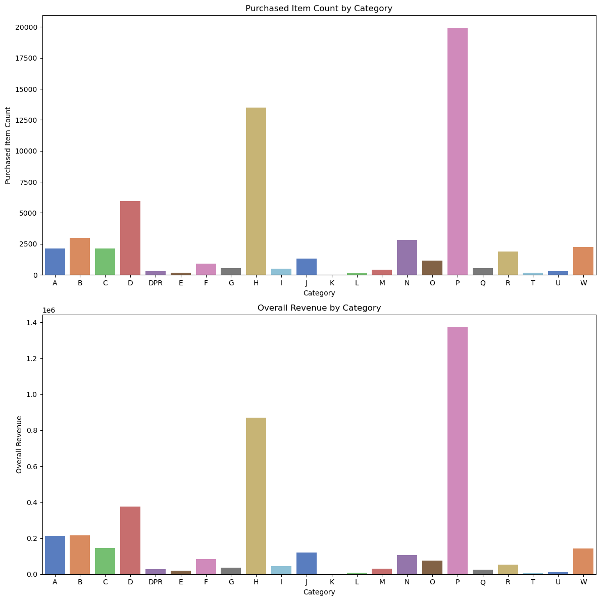

### 🎈 RFM 분석

#### 📌분석 대상 데이터

##### 1) 🚗 상품 주문 데이터

#### **✏️주제: 상품 주문 데이터에 대한 분석을 바탕으로, RFM 점수를 산정하여 마케팅 전략을 제안한다.**

---

#### 📚 Columns

> Item Name: 상품의 이름 또는 설명  
> Category: 상품의 카테고리  
> Version: 상품의 버전  
> Item Code: 상품의 고유 코드  
> Item ID: 상품의 고유 id  
> Buyer ID: 상품을 구매한 고객의 고유 id  
> Transaction ID: 해당 주문 또는 거래의 id  
> Date: 해당 주문 또는 거래가 이루어진 날짜  
> Final Quantity: 최종 주문 수량  
> Total Revenue: 총 수익. 할인 또는 취소를 고려하지 않음.  
> Price Reductions: 할인 가격  
> Refunds: 환불/취소된 가격 총액  
> Final Revenue: 최종 수익. 할인 또는 취소된 가격을 포함하나 세금은 포함하지 않음.  
> Sales Tax: 거래에 적용된 세금  
> Overall Revenue: 전체 수익. 할인 또는 취소된 가격 및 세금까지 전부 포함함.  
> Refunded Item Count: 환불/취소된 수량  
> Purchased Item Count: 구매한 수량

#### **📌목차**

1. 데이터 전처리

2. RFM 점수 산정

3. RFM 점수에 따른 고객 등급 분류

4. 데이터 시각화 및 분석

5. 마케팅 전략 제안

#### 1. 데이터 전처리

##### 1) 중복행, 결측치, 이상치 검사 및 처리

-   중복된 행이 1개 존재하여 삭제하였습니다.
-   결측치는 존재하지 않았습니다.
-   Category 컬럼의 값들을 `value_counts()`로 확인해보았을 때, 다른 카테고리와 다른 형태를 띤 'DPR'이라는 카테고리가 존재했습니다.
-   카테고리가 DPR인 데이터의 다른 컬럼 값들을 보았을 때 문제가 없었으므로, 정상 데이터로 판단 후 넘어갔습니다.
-   Date 컬럼의 `dtype`을 `pd.to_datetime()`을 통해 날짜 형식으로 변환하였습니다.
-   Date 컬럼의 값을 `describe()`을 통해 확인한 결과, 아래처럼 문제가 없었습니다.

-   최종 주문 수량(Final Quantity)의 값이 0인 경우, 구매/취소/환불 모두 해당하지 않으므로  
    RFM 산정 시 제외하기 위해 삭제하였습니다.
-   총 수익(Total Revenue)와 할인 가격(Price Reductions)의 분포를 `describe()`로 살펴보았습니다.

-   총 수익의 경우 구매 데이터의 경우 양수, 취소/환불의 경우 0을 값으로 가지며 음수가 존재하지 않으므로,  
    모델 학습이 아닌 데이터 분석의 관점에서 보았을 때의 이상치는 존재하지 않았습니다.
-   할인 가격 또한 마찬가지로 데이터 분석의 관점에서 보았을 때의 이상치가 존재하지 않았습니다.
-   다만, 최종 주문 수량(Final Quantity)가 음수이지만 환불 가격(Refunds)이 0인 행이 존재하여,  
    해당 행을 삭제하였습니다.

##### 2) 불필요한 컬럼 삭제

-   Category 컬럼의 경우 'DPR' 카테고리를 제외하면 'Product' 로 시작하는 공통점을 가지므로,  
    구분을 위해 Product 뒤의 알파벳만 남기고 나머지 문자열을 삭제하였습니다.
-   Version 컬럼은 불필요하므로 삭제하였습니다.
-   상품의 고유 id(Item ID)가 존재하므로 Item Code 컬럼을 삭제하였습니다.
-   추후 RFM중 M(Monetary) 계산 시 세금(Sales Tax) 및 할인 금액(Price Reductions)이 모두 반영된  
    총액인 Overall Revenue를 기준으로 계산할 예정이므로,  
    Total Revenue, Price Reductions, Final Revenue, Sales Tax 컬럼을 삭제하였습니다.

#### 2. RFM 점수 산정

> 구매한 기록이 있는 고객만을 대상으로 RFM 점수를 산정하였습니다.  
> 고객의 id(Buyer ID)를 기준으로 취소/환불이 아닌 구매 데이터의 가장 최근 날짜를 가져와  
> R(Recency)을 계산하였습니다.  
> 고객의 id(Buyer ID)를 기준으로 취소/환불이 아닌 구매 수량의 총합을 구하여  
> F(Frequency)를 계산하였습니다.  
> 고객의 id(Buyer ID)를 기준으로 취소/환불을 포함한 결제 총액을 구하여  
> M(Monetary)을 계산하였습니다.

-   고객의 id(Buyer ID)로 `groupby()`를 통해 RFM을 각각 계산하였습니다.
-   가장 최근 날짜를 기준으로 각 구매 데이터의 날짜와의 차이를 구하여 Recency 컬럼에 저장하였습니다.

-   구매 수량의 총합을 구하여 Frequency 컬럼에 저장하였습니다.

-   취소/환불 금액을 포함한 결제 총액을 구하여 Monetary 컬럼에 저장하였습니다.

-   Recency, Frequency, Monetary에 대한 각각의 데이터프레임을 하나로 `merge`하였습니다.

-   scikit-learn의 `MinMaxScaler`을 활용하여 0~1 사이의 값으로 각 수치를 정규화하였습니다.
-   이 때, **제일 최근 날짜일 수록 더 큰 Recency**값을 가져야 하므로,  
    Recency 컬럼의 값을 각각 1에서 뺀 값으로 대체하였습니다.
-   Recency, Frequency, Monetary 수치를 더한 값을 TotalScore 컬럼에 저장하였습니다.

-   원본 데이터프레임에 Buyer ID를 기준으로 merge하여 TotalScore 컬럼을 추가하였습니다.

#### 3. RFM 점수에 따른 고객 등급 분류

-   RFM 점수에 따라 Bronze, Silver, Gold, Diamond, VIP의 총 5개 등급으로 고객을 그룹화하였습니다.

#### 4. 데이터 시각화 및 분석

##### 1) 📌등급별 고객 수 시각화

-   Silver와 Gold 등급의 고객 수가 가장 많고, Bronze와 Diamond 등급의 고객 수는 그 다음으로 많았으며  
    VIP 등급의 고객 수는 상대적으로 적게 나타났습니다.

##### 2) 📌등급별 구매 빈도 및 매출액 시각화

-   고객 등급별 구매 빈도와 매출액을 시각화한 결과, 두 그래프 모두 비슷한 양상을 보였습니다.
-   따라서 모든 등급에서 구매 빈도가 높은 고객일 수록 매출액에 기여하는 비중이 크다고 볼 수 있습니다.

##### 3) 📌등급별 카테고리에 따른 구매 빈도 및 매출액 시각화

-   앞서 구매 빈도와 매출액의 고객 등급별 분포가 유사한 양상을 보였던 것처럼,  
    카테고리에 따른 구매 빈도와 매출액 또한 유사한 분포 양상을 보였습니다.
-   따라서 매출액의 비중에 주목하여, 특히 매출액 기준 상위 4개 카테고리인 P, H, D, B를  
    파이 그래프로 나타냄으로써 등급별 비중을 자세히 분석하고자 하였습니다.

-   B 카테고리의 경우 Bronze 등급의 매출액 비중이 가장 높게 나타났으며,  
    등급이 상승할 수록 매출액 비중이 낮아지는 양상을 보였습니다.
-   따라서 B 카테고리의 제품들은  
    (1)타 카테고리 제품에 비해 구매 수량, 또는 구매 빈도(Frequency)가 낮을 가능성이 있으며,  
    (2)혹은 평균 가격이 다른 카테고리의 평균 가격보다 낮아 타 등급보다 상대적으로  
    Monetary 점수가 낮을 수 있는 Bronze 등급의 고객 비중이 높을 가능성이 있고,  
    (3)신규 고객의 구매 비중이 낮아 Recency가 낮을 수 있습니다.
-   이를 바탕으로 영가설들을 세우고 검증하였습니다.

##### 4) ⏬영가설 1

**B 카테고리 제품의 Bronze 등급 매출액 비중이 높은 것은,**  
**타 카테고리 제품에 비해 평균 구매 수량이 낮기 때문이다.**

-   해당 가설을 검증하기 위해 앞서 분석했던 4개의 카테고리(P, H, D, B)를 대상으로  
    거래별 평균 구매 수량을 시각화하였습니다.

-   다른 카테고리에 비해 평균 구매 수량이 낮아 낮은 Frequency 점수를 보였을 것으로 예상했던  
    영가설 1과는 달리, 매출액 기준 상위 4개의 카테고리 모두 평균 구매 수량은 대체로 비슷했습니다.

**❌영가설 1은 참이 아니었음을 확인할 수 있습니다.**

##### 5) ⏬영가설 2

**B 카테고리 제품의 Bronze 등급 매출액 비중이 높은 것은,**  
**타 카테고리 제품에 비해 평균 가격이 낮기 때문이다.**

-   해당 가설을 검증하기 위해 앞서 주목한 4개의 카테고리에 대해 고객이 지불한 수량별 가격을  
    구한 뒤 시각화하였습니다.

-   B 카테고리 제품의 제품 1개 당 평균 가격을 살펴본 결과, 영가설 2와는 반대로 오히려 가장 높은  
    평균 가격 및 가격 분포를 보였습니다.
-   따라서 B 카테고리 제품 구매 고객 중 Bronze 등급 고객의 비중이 높은 것은,  
    낮은 평균 가격으로 인한 낮은 Monetary 점수에서 기인한 결과라고 보기 어렵다고 판단됩니다.

**❌영가설 2 또한 참이 아니었음을 확인할 수 있습니다.**

##### 6) ⏬영가설 3

**B 카테고리 제품의 Bronze 등급 매출액 비중이 높은 이유는,**  
**신규 거래의 비중이 적어 구매 고객의 Recency 점수가 낮기 때문이다.**

-   해당 가설을 검증하기 위해 B 카테고리 제품 판매 데이터 중 판매 날짜에 주목하였습니다.

-   대체로 B 카테고리의 제품을 구매한 데이터는 Recency 점수를 감소시킬 수 있는,  
    최근보다는 이전의 날짜에 주로 분포하는 것을 확인할 수 있습니다.

**✅영가설 3은 참으로 판단할 수 있습니다.**

-   하지만, B 카테고리의 제품을 구매한 고객이 다른 카테고리의 제품을 더 많이 구매했을 수 있는 점 등,  
    복합적인 요인이 영향을 주었을 수 있으므로 해당 영가설만으로는 Bronze 등급의 매출액 비중이 높은  
    이유를 완전히 설명하기 어렵다고 판단됩니다.

#### 5. 🎈마케팅 전략 제안

-   Bronze 등급의 경우 가장 높은 매출액 비중을 보인 B 카테고리를 제외한다면 대체로 고른 분포를 보이고 있습니다. 따라서 Bronze 등급의 고객들을 더 높은 등급의 고객, 즉 충성고객으로 전환할 수 있도록 전체 카테고리의 제품을 대상으로 재구매 할인 혜택을 제공하거나, 포인트 제도를 도입하여 누적 포인트에 따라 승급 혜택을 제공함으로써 충성도를 높이는 방향이 효과적일 것으로 예상됩니다.

-   또한 친구나 가족을 추천할 경우 추가적인 프로모션 혜택을 제공함으로써, 신규 고객을 유치함과 동시에 기존 Bronze 등급의 회원들의 이용 빈도를 증가시켜 더 높은 등급의 고객으로 유도할 수 있습니다.

-   매출액의 가장 많은 비중을 차지하는 Silver 및 Gold 등급의 경우 업셀링(Upselling) 및 크로스셀링(Cross-selling) 전략이 효과적일 수 있습니다. 예를 들어, Silver나 Gold 등급의 고객들이 구매하고자 하는 제품이나 서비스에 대해 더 높은 가격대의 제품 및 서비스를 추천하는 업셀링 전략이나, 해당 등급의 고객들의 구매 이력이 있는 제품들과 유사한 제품이나 해당 제품을 보조할 수 있는 제품(액세서리 등)을 추천하는 크로스셀링 전략을 통해 매출액을 크게 증대시킬 수 있습니다.

-   매출액을 기반으로 비교적 낮은 비중을 차지하는 Diamond 및 VIP 등급의 경우 해당 등급에 대한 독점적인 온라인/오프라인 이벤트를 제공하는 방법이 효과적일 것으로 예상됩니다. 예를 들어, 신제품 발표 행사의 초청권을 제공하거나 고급 브랜드와의 협업 이벤트 및 무료 배송 혜택을 제공할 수 있습니다.

-   또한 제품 및 서비스 구매 이력이 많은 해당 등급의 고객들을 대상으로 지속적인 피드백 및 소통을 유지함으로써 요구사항을 분석 및 반영하고, 이를 바탕으로 제품을 개선할 수 있음과 동시에 해당 등급 고객들의 충성도를 높임으로써 매출액 비중을 증가시킬 수 있습니다.
