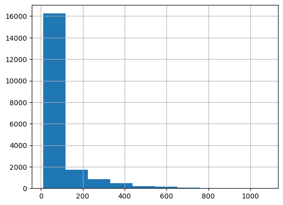
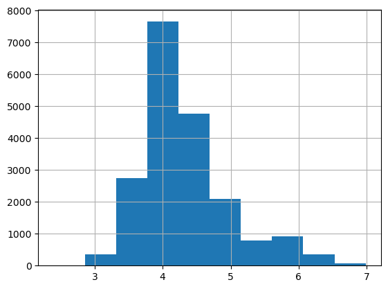
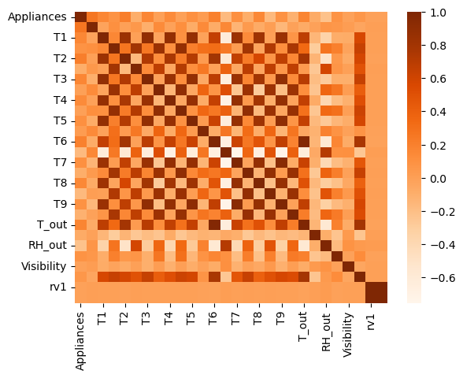
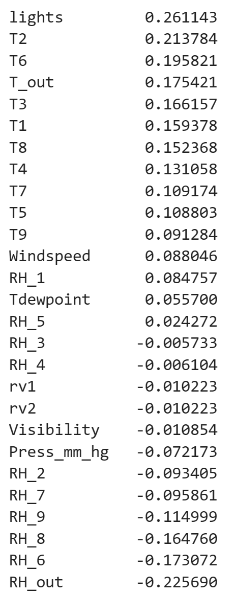
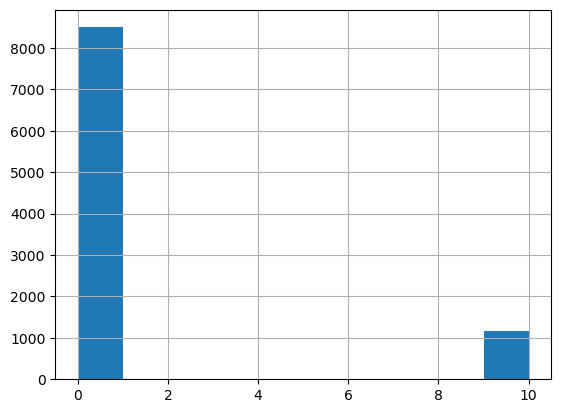
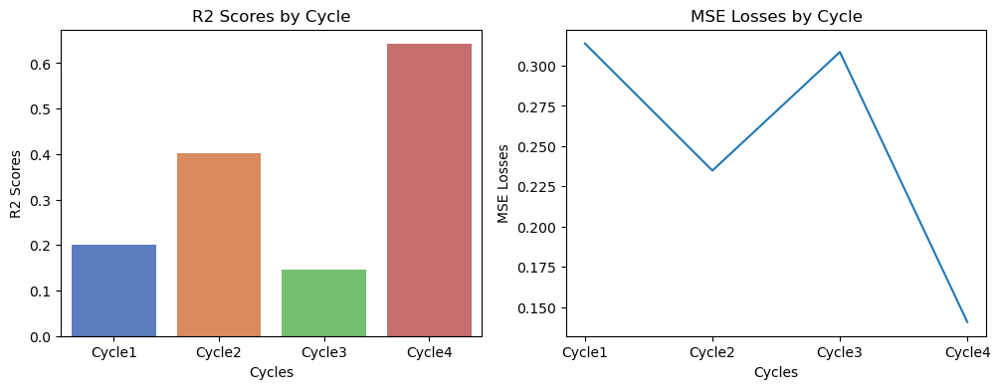

### 📌 가전제품 에너지 사용량 회귀 예측

> 저에너지(low-energy) 건물 내에서 ZigBee 무선 센서 네트워크로 수집된 데이터와,  
>  Chievres 기상 관측소에서 수집된 데이터를 결합한 데이터 세트입니다.

#### 📚 Features

-   date: 측정 날짜 및 시간
-   lights: 조명 장치의 전기 에너지 사용량
-   T1: 부엌의 온도
-   RH_1: 부엌의 습도
-   T2: 거실의 온도
-   RH_2: 거실의 습도
-   T3: 세탁실의 온도
-   RH_3: 세탁실의 습도
-   T4: 사무실의 온도
-   RH_4: 사무실의 습도
-   T5: 욕실의 온도
-   RH_5: 욕실의 습도
-   T6: 건물 밖(북쪽)의 온도
-   RH_6: 건물 밖(북쪽)의 습도
-   T7: 다리미방의 온도
-   RH_7: 다리미방의 습도
-   T8: 자녀 방의 온도
-   RH_8: 자녀 방의 습도
-   T9: 부모님 방(안방)의 온도
-   RH_9: 부모님 방(안방)의 습도
-   T_out: 바깥(Chievres weather station)의 온도
-   Press_mm_hg: 바깥(Chievres weather station)의 대기압
-   RH_out: 바깥(Chievres weather station)의 습도
-   Windspeed: 바깥(Chievres weather station)의 풍속
-   Visibility: 바깥(Chievres weather station)의 가시거리
-   Tdewpoint: 바깥(Chievres weather station)의 이슬점 온도
-   rv1: 랜덤한 변량 1
-   rv2: 랜덤한 변량 2

#### 🎈 Target

-   Appliances: 에너지 사용량 (Wh)

---

#### 📌 목차

_🎈Cycle 1_

1. 데이터 탐색 및 전처리
2. PCA를 통한 차원 축소
3. 선형 회귀 분석
4. 트리 기반 회귀 모델을 사용한 회귀 분석

_🎈Cycle 2_

1. OLS, VIF 확인 및 데이터 전처리
2. PCA를 통한 차원 축소
3. 선형 회귀 분석
4. 트리 기반 회귀 모델을 사용한 회귀 분석

_🎈Cycle 3_

1. feature별 분포 확인 및 전처리
2. 선형 회귀 분석
3. lights feature에 언더샘플링 적용
4. 언더샘플링 이후 선형 회귀 분석
5. 언더샘플링 이후 트리 기반 모델을 사용한 회귀 분석

_🎈Cycle 4_

1. 데이터 전처리
2. 선형 회귀 분석
3. 트리 기반 모델을 사용한 회귀 분석
4. GridSearchCV, RandomForestRegressor 모델을 사용한 회귀 분석

**_📌Cycle 1 ~ Cycle 4, R2 및 MSE Loss 값 비교_**

#### _🎈Cycle 1_

#### 1. 데이터 탐색 및 전처리

-   결측치와 중복행 모두 존재하지 않았습니다.
-   히스토그램으로 분포를 확인해본 결과, 종속변수의 분포가 좌측으로 치우쳐 나타났습니다.
-   좌측은 원본 종속변수의 분포, 우측은 log1p 스케일링을 적용한 종속변수의 분포입니다.

-   따라서 종속변수에 log1p 스케일링을 적용했습니다.
-   또한 회귀 예측에 불필요하다고 판단하여 date feature를 삭제했습니다.
-   아래는 나머지 독립변수들과 종속변수의 상관관계를 히트맵으로 시각화한 자료입니다.

-   독립변수 간의 상관관계가 대체로 크게 나타났습니다.
-   또한, 종속변수와의 상관관계가 높은 feature를 확인하기 어려워 수치로 확인해보았습니다.

-   종속변수와의 상관관계 절댓값이 0.3을 넘는 독립변수가 존재하지 않았습니다.
-   feature의 개수 또한 date 삭제 후에도 총 27개이므로, 차원 축소를 진행해야 한다고 판단했습니다.
-   PCA를 통한 차원 축소를 진행하여 독립 변수 간의 상관관계로 인해 나타날 수 있는 다중 공선성 문제를 해결하고,  
    계산의 효율성을 높이고자 하였습니다.
-   차원 축소를 진행하기 전 StandardScaler()를 통해 표준화를 진행하여 이상치를 제거했습니다.

#### 2. PCA를 통한 차원 축소

-   이상치를 제거한 데이터를 바탕으로 먼저 2차원으로 축소해보았습니다.
-   `explained_variance_ratio_`를 통해 축소된 2개의 feature가 원본 feature를 얼마나 잘 표현하는지 보았을 때, 약 0.77로 준수한 표현력을 보였습니다.

#### 3. 선형 회귀 분석

-   파이프라인을 구축하여, 표준화 진행 후 PCA를 통해 2차원으로 축소하여 선형 회귀 예측을 수행했습니다.
-   회귀 모델은 scikit-learn의 LinearRegression 모델을 사용했습니다.
-   회귀 예측 결과 평가 지표는 아래와 같이 나타났습니다.
-   `MSE: 0.3862, RMSE: 0.6214, MSLE: 0.0123, RMSLE: 0.1110, R2: 0.0159`
-   매우 낮은 예측 성능을 보였으므로, 트리 기반 회귀 모델로 다시 한 번 회귀 분석을 진행했습니다.

#### 4. 트리 기반 회귀 모델을 사용한 회귀 분석

-   마찬가지로 파이프라인을 구축하여 표준화 및 차원 축소를 진행한 후 모델 학습을 진행했습니다.
-   사용한 모델은 아래와 같습니다:

    -   DecisionTreeRegressor
    -   RandomForestRegressor
    -   GradientBoostingRegressor
    -   XGBRegressor
    -   LGBMRegressor

-   이때 각 모델의 예측 결과 평가 지표는 아래와 같이 나타났습니다.

<code>DecisionTreeRegressor  
MSE: 0.5292, RMSE: 0.7275, MSLE: 0.0168, RMSLE: 0.1295, R2: -0.3486  
RandomForestRegressor  
MSE: 0.3138, RMSE: 0.5602, MSLE: 0.0100, RMSLE: 0.1000, R2: 0.2004  
GradientBoostingRegressor  
MSE: 0.3629, RMSE: 0.6024, MSLE: 0.0115, RMSLE: 0.1074, R2: 0.0751  
XGBRegressor  
MSE: 0.3193, RMSE: 0.5651, MSLE: 0.0103, RMSLE: 0.1013, R2: 0.1862  
LGBMRegressor  
MSE: 0.3266, RMSE: 0.5715, MSLE: 0.0104, RMSLE: 0.1018, R2: 0.1677</code>

-   이 중에서 가장 높은 R2와 가장 낮은 RMSE를 보인 RandomForestRegressor 모델 또한,  
    R2가 약 0.2004로 매우 낮았습니다.
-   따라서 Cycle 2로 넘어가 다시 전처리를 수행합니다.

#### 🎈Cycle 2

#### 1. OLS, VIF 확인 및 데이터 전처리

-   OLS 확인 결과 p-value가 높은 feature들이 존재했습니다.
-   해당 feature들은 T1, T4, RH_4, T_out, RH_out, Visibility, rv1, rv2 였습니다.
-   이 중에서 삭제할 feature를 결정하기 위해 VIF를 통한 다중 공선성과,  
    종속변수와의 상관관계를 확인해보았습니다.
-   앞선 feature들의 VIF 점수는 각각 약 4245.8, 1202.9, 1445.7, 1006.4, 3844.2, 16.9, inf, inf였습니다.
-   또한 종속변수와의 상관관계는 각각 약 0.16, 0.13, -0.006, 0.17, -0.22, -0.01, -0.01, -0.01이었습니다.
-   따라서 가장 상관관계가 낮은 T1, T4, RH_4, Visibility, rv1, rv2 를 삭제했습니다.
-   이후 OLS를 확인한 결과, 여전히 T_out과 RH_out의 p-value가 너무 크게 나타나, 해당 feature들 또한 삭제했습니다.
-   VIF 상에서 전체적으로 감소하였으나, 여전히 높은 feature들이 존재하여 다중 공선성이 우려되었지만  
    OLS 상에서 보았을 때 p-value가 0.05 이상인 feature가 모두 사라졌으므로  
    PCA를 통한 차원 축소를 진행하여 회귀 예측 결과를 다시 살펴보고자 했습니다.

#### 2. PCA를 통한 차원 축소

-   2차원으로 축소한 후 `explained_variance_ratio_`는 약 0.8849로, 이전의 값(약 0.77)보다  
    값이 많이 증가하였음을 알 수 있습니다.

#### 3. 선형 회귀 분석

-   Cycle 1과 동일한 방식으로 파이프라인을 구축하여 표준화 및 차원 축소, 선형 회귀 분석을 진행합니다.
-   `MSE: 0.3555, RMSE: 0.5962, MSLE: 0.0113, RMSLE: 0.1063, R2: 0.0941`
-   3차원으로 축소하였을 때의 R2는 2차원이나 4차원, 혹은 다른 차원으로 축소했을 시보다  
    높았지만, 여전히 약 0.0941로 매우 낮았습니다.
-   따라서 다시 한 번 트리 기반 회귀 모델로 회귀 분석을 진행했습니다.

#### 4. 트리 기반 회귀 모델을 사용한 회귀 분석

-   Cycle 1과 동일한 모델을 사용하여 회귀 분석을 진행한 결과, 각 모델별 평가 지표는 아래와 같이 나타났습니다.

<code>DecisionTreeRegressor  
MSE: 0.4461, RMSE: 0.6679, MSLE: 0.0139, RMSLE: 0.1179, R2: -0.1368  
RandomForestRegressor  
MSE: 0.2348, RMSE: 0.4845, MSLE: 0.0074, RMSLE: 0.0860, R2: 0.4018  
GradientBoostingRegressor  
MSE: 0.3266, RMSE: 0.5715, MSLE: 0.0103, RMSLE: 0.1017, R2: 0.1677  
XGBRegressor  
MSE: 0.2694, RMSE: 0.5190, MSLE: 0.0086, RMSLE: 0.0925, R2: 0.3135  
LGBMRegressor  
MSE: 0.2797, RMSE: 0.5288, MSLE: 0.0089, RMSLE: 0.0942, R2: 0.2873</code>

-   Cycle 2 결과, RandomForestRegressor에서 R2가 약 0.4018로 많이 상승하였습니다.
-   Cycle 3으로 넘어가 각 feature들의 분포를 좀 더 조절하는 방향으로 진행해보겠습니다.

#### 🎈Cycle 3

#### 1. feature별 분포 확인 및 전처리

-   lights feature의 분포를 확인한 결과 아래와 같았습니다.

-   `value_counts()`를 통해 분포 비중을 수치로 확인해봅니다.

          lights
          0     8502
          10    1177

-   언더샘플링하기에는 비중 차이가 너무 크다고 판단하여, 삭제 여부를 결정하기 위해 종속변수와의 상관관계를 확인해보았습니다.
-   lights의 종속변수와의 상관관계는 약 0.18로, 삭제해도 무방하다고 판단하였습니다.
-   하지만 전체적으로 모든 feature의 종속변수와의 상관관계가 낮으므로,  
    lights 삭제 시 회귀 예측 정확도가 오히려 떨어질 수 있기 때문에 삭제 후의 결과를 확인한 후 다시 결정하고자 합니다.

#### 2. 선형 회귀 분석

-   lights 를 삭제한 후 앞선 Cycle과 동일한 방식으로 파이프라인을 구축하여 선형 회귀 예측을 진행합니다.
-   `MSE: 0.3595, RMSE: 0.5996, MSLE: 0.0114, RMSLE: 0.1069, R2: 0.0838`
-   lights를 삭제하기 전 선형 회귀 분석 결과 R2는 약 0.0941로, 삭제 후의 성능이 더 감소하였음을 알 수 있습니다.
-   따라서 lights를 삭제하기보다는, 언더샘플링을 통해 비중을 맞춰준 후 회귀 예측을 진행하는 것이 낫다고 판단하였습니다.

#### 3. lights feature에 언더샘플링 적용

-   lights feature에 0 값을 가진 행 중에서 10 값을 가진 행의 개수(1177개)만큼 언더샘플링합니다.

#### 4. 언더샘플링 이후 선형 회귀 분석

-   언더샘플링한 범주형 feature인 lights를 분리한 후 차원 축소를 진행합니다.
-   축소 후 다시 lights feature를 결합하여 회귀 분석을 진행합니다.
-   `MSE: 0.3085, RMSE: 0.5554, MSLE: 0.0097, RMSLE: 0.0986, R2: 0.1451`
-   언더샘플링 이후 PCA는 4차원으로 축소하였을 때 R2가 약 0.1451로 가장 높았으며,  
    이전 Cycle보다 상승한 모습을 보였습니다.
-   트리 기반 모델을 사용하여 다시 회귀 분석을 수행합니다.

#### 5. 언더샘플링 이후 트리 기반 모델을 사용한 회귀 분석

-   앞선 Cycle에서와 동일한 트리 기반 모델을 사용합니다.
-   각 모델별 회귀 분석 결과 평가 지표는 아래와 같았습니다.

<code>DecisionTreeRegressor  
MSE: 0.7535, RMSE: 0.8680, MSLE: 0.0235, RMSLE: 0.1534, R2: -1.0882  
RandomForestRegressor  
MSE: 0.3475, RMSE: 0.5895, MSLE: 0.0111, RMSLE: 0.1052, R2: 0.0369  
GradientBoostingRegressor  
MSE: 0.3236, RMSE: 0.5688, MSLE: 0.0103, RMSLE: 0.1016, R2: 0.1032  
XGBRegressor  
MSE: 0.4100, RMSE: 0.6403, MSLE: 0.0131, RMSLE: 0.1143, R2: -0.1362  
LGBMRegressor  
MSE: 0.3451, RMSE: 0.5874, MSLE: 0.0110, RMSLE: 0.1047, R2: 0.0436</code>

-   분포가 맞지 않는 feature인 lights를 대상으로 언더샘플링을 진행하였음에도 불구하고,  
    R2는 GBR(GradientBoostingRegressor)에서 가장 높았지만 약 0.1032로 낮았습니다.
-   따라서 Cycle 4에서는 가장 먼저 삭제했던 feature인 date를 각각 연도, 월, 일, 시간으로 나눈 후,  
    새로운 feature로 추가하고자 합니다.

#### 🎈 Cycle 4

#### 1. 데이터 전처리

-   'date' feature를 연도, 월, 일, 시간으로 나누어 데이터프레임에 추가합니다.
-   앞선 Cycle에서 처리했던 전처리 과정을 동일하게 수행합니다.
-   이후 OLS와 VIF 및 종속변수와의 상관관계를 바탕으로, 새로 추가한 날짜/시간 관련 feature 중  
    삭제할 feature가 있는지 확인하였습니다.
-   'year' feature의 상관관계는 NaN이었으므로 삭제합니다.
-   새로운 feature 추가 후 OLS에서 p-value가 높아진 feature들이 존재했습니다.
-   해당 feature들(RH_3, T9)을 삭제합니다.
-   여전히 OLS에서 p-value가 높은 'day' feature는 종속변수와의 상관관계가 약 0.02로 낮았으므로 삭제합니다.
-   또한 VIF가 높아 다중공선성에 문제가 있는 feature들을 삭제합니다.
-   lights feature의 경우, 앞선 Cycle 3에서 언더샘플링을 진행하였을 때  
    트리 기반 회귀 모델에서 이전 Cycle보다 낮아진 수치를 보였으므로, feature 자체를 삭제합니다.

#### 2. 선형 회귀 분석

-   Cycle 1, Cycle 2와 동일한 방식으로 파이프라인을 구축하여 표준화 및 차원 축소, 선형 회귀분석을 진행합니다.
-   `MSE: 0.3312, RMSE: 0.5755, MSLE: 0.0105, RMSLE: 0.1024, R2: 0.1560`
-   차원 축소 시의 차원을 8차원까지 올렸음에도 R2가 약 0.1560으로 낮았습니다.

#### 3. 트리 기반 모델을 사용한 회귀 분석

-   앞선 Cycle에서 사용한 트리 기반 모델들을 사용하여 회귀 분석을 수행하였습니다.
-   결과는 아래와 같았습니다.

<code>DecisionTreeRegressor  
MSE: 0.2660, RMSE: 0.5158, MSLE: 0.0085, RMSLE: 0.0920, R2: 0.3220  
RandomForestRegressor  
MSE: 0.1423, RMSE: 0.3773, MSLE: 0.0045, RMSLE: 0.0672, R2: 0.6373  
GradientBoostingRegressor  
MSE: 0.2744, RMSE: 0.5238, MSLE: 0.0086, RMSLE: 0.0929, R2: 0.3008  
XGBRegressor  
MSE: 0.1694, RMSE: 0.4116, MSLE: 0.0054, RMSLE: 0.0735, R2: 0.5682  
LGBMRegressor  
MSE: 0.1876, RMSE: 0.4331, MSLE: 0.0060, RMSLE: 0.0772, R2: 0.5220</code>

-   트리 기반 모델을 사용했을 때에는 PCA를 통해 7차원으로 축소한 후 RandomForestRegressor 모델을  
    사용하였을 때 가장 높은 성능을 보였습니다.
-   따라서 GridSearchCV를 통해 최적의 하이퍼파라미터 조합을 찾아 R2을 더 증가시키고,  
    오차를 줄이는 방향을 찾아보고자 하였습니다.

#### 4. GridSearchCV, RandomForestRegressor를 사용한 회귀 분석

-   GridSearchCV를 통해 교차 검증으로 찾아낸 best*estimator* 모델로 예측을 수행한 결과는 아래와 같았습니다.
-   `MSE: 0.1603, RMSE: 0.4004, MSLE: 0.0050, RMSLE: 0.0710, R2: 0.5914`
-   이는 GridSearchCV 없이 RandomForestRegressor 모델로 예측을 수행했을 때의 R2(약 0.6373)보다 낮은 수치입니다.
-   다만, `cv_results_`에서 보았을 때, `n_estimators=1000`일 때 R2가 높아지는  
    경향을 보였으므로, 직접 조정하여 학습해보았습니다.
-   `max_depth` 하이퍼파라미터 조정 없이, `n_estimators=1000`으로 RandomForestRegressor 모델을  
    생성한 후 회귀 예측을 수행하였을 때의 결과는 아래와 같았습니다.
-   `MSE: 0.1406, RMSE: 0.3750, MSLE: 0.0045, RMSLE: 0.0667, R2: 0.6417`
-   `n_estimators=1000`으로 조정한 결과, R2를 약 0.6417까지 증가시킬 수 있었습니다.

#### 📌Cycle 1 ~ Cycle 4, R2 및 MSE Loss 비교

-   각 Cycle 별 최고 성능을 보인 모델의 R2와 MSE Loss를 비교하여 시각화한 자료입니다.

