### 📌 학생 시험 점수 회귀 예측

#### 📚 Features

-   Hours Studied: 공부 시간
-   Previous Scores: 이전 시험에서 취득한 점수
-   Extracurricular Activities: 방과후 학습 참여 여부
-   Sleep Hours: 평균 수면 시간
-   Sample Question Papers Practiced: 학생이 공부한 연습문제지 개수

#### 🎈 Target

-   Performance Index: 시험 점수

---

#### 📌 목차

1. 데이터 탐색 및 전처리
2. 선형 회귀 분석
3. OLS, VIF 확인
4. 교차 검증 및 Pytorch를 통한 loss 변화 비교
5. 일반화를 위해 Lasso(L1), Ridge(L2)를 통한 규제 적용

#### 1. 데이터 탐색 및 전처리

-   결측치가 존재하지 않았으며, 약 127개의 중복행을 삭제하였습니다.

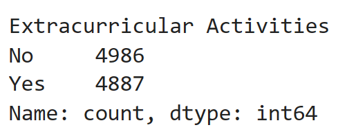

-   범주형 feature인 'Extracurricular Activities' feature의 분포는 위와 같이 두 개의 범주가 비슷한 데이터 수를 보였습니다.
-   하지만, 종속변수와의 상관관계를 확인하였을 때 아래처럼 약 0.02로 매우 낮게 나타나 삭제하기로 결정했습니다.

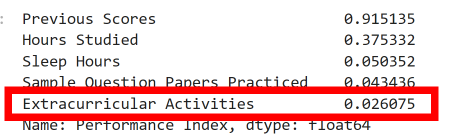

-   나머지 수치형 feature들과 target의 분포를 히스토그램으로 시각화한 결과는 아래와 같았습니다.

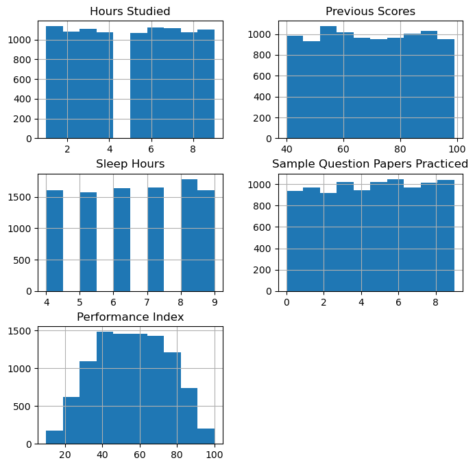

-   독립변수와 종속변수를 포함하여 상관관계를 히트맵으로 시각화한 결과는 아래와 같았습니다.

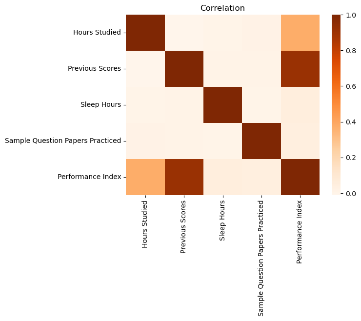

-   독립변수 사이의 상관관계는 0에 가까운 양상을 띠었습니다.

#### 2. 선형 회귀 분석

-   scikit-learn의 LinearRegression 모델을 사용하여 선형 회귀 예측을 수행한 결과 아래와 같았습니다.
-   `MSE: 4.1479, RMSE: 2.0367, MSLE: 0.0021, RMSLE: 0.0461, R2: 0.9885`
-   선형 회귀 분석 결과 R2는 약 0.9885로 매우 높게 나타났으므로,  
    해당 데이터는 선형 데이터의 형태를 띤다고 볼 수 있습니다.
-   R2 값을 보았을 때 과적합되었을 가능성이 있다고 판단하여 추가적인 분석을 진행했습니다.

#### 3. OLS, VIF 확인

-   OLS 상에서 확인하였을 때, R2는 약 0.990으로 실제 회귀 예측 시와 비슷했습니다.
-   p-value 또한 모든 독립변수에서 0.000의 값을 보였으며, Durbin-Watson 점수 또한 1.918로 매우 높았습니다.
-   VIF를 확인해보았을 때 각 독립변수의 vif_score는 아래와 같았습니다.

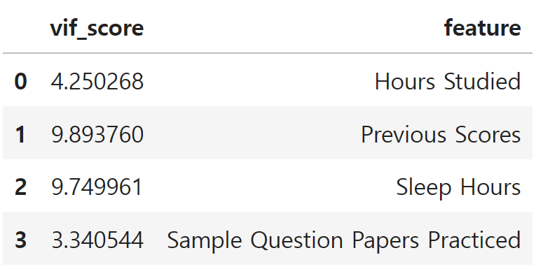

-   OLS 및 VIF에서 큰 문제가 없다고 판단하여 다른 방식으로 과적합 여부를 판단하기로 했습니다.

#### 4. 교차 검증 및 Pytorch를 통한 loss 변화 비교

-   앞서 OLS와 VIF에서 문제가 없었으므로, 이번에는 교차 검증을 통해 과적합 여부를 판단합니다.
-   `cross_val_score()`를 통해 훈련 데이터에 대한 교차 검증을 진행하였을 때,  
    평균 R2는 약 0.9884로 테스트 데이터에 대한 실제 회귀 예측 시의 R2인 0.9885와 비슷했습니다.
-   따라서 과적합이 발생하지 않았다고 예상되지만, 좀 더 정확한 판단을 위해 직접 검증 데이터를 나누어  
    Pytorch를 통해 loss를 시각화해보았습니다.

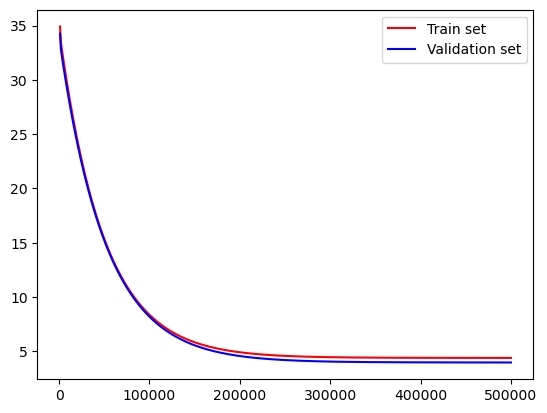

-   훈련 데이터를 다시 `train_test_split()`을 통해 훈련 데이터와 검증 데이터로 나눈 후,  
    각 데이터에 대해 각각 1,000,000번의 epoch를 반복하며 loss의 변화를 기록하였습니다.
-   500,000 epoch부터 loss의 변화가 거의 없어 그래프에는 500,000 epoch까지의 loss를 시각화하였습니다.
-   가중치와 편향은 각각 `torch.zeros()`를 통해 0으로 초기화한 후 SGD 경사하강법으로 학습을 진행하였고, 학습률(learning_rate)은 0.00019로 진행하였습니다.
-   기록 결과 훈련 데이터와 검증 데이터의 loss 변화 그래프가 매우 비슷한 양상을 띰으로써,  
    과적합이 발생하지 않았음을 알 수 있습니다.

#### 5. 일반화를 위해 Lasso(L1), Ridge(L2)를 통한 규제 적용

-   LinearRegression 모델로 회귀 예측을 진행했을 때, 학습 데이터와 테스트 데이터에 대한 예측값과 실제 정답을 시각화한 결과는 아래와 같았습니다.

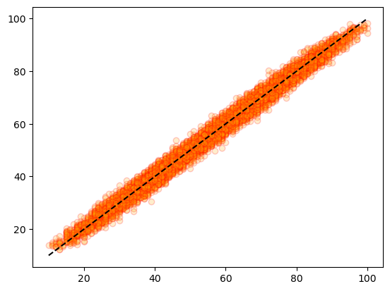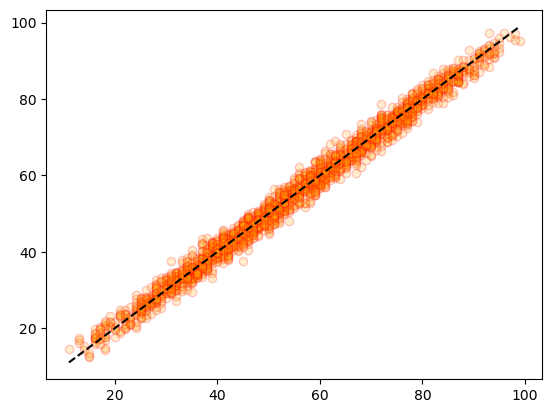

-   과적합은 발생하지 않았다고 판단되지만, 모델의 일반화를 위해 테스트 데이터에서의 R2를 약 0.95 수준으로 낮추기 위한 규제를 적용했습니다.
-   Lasso에서 alpha=9, max_iter=10000으로 설정 후 규제를 적용하였을 때 약 0.9510,  
    Ridge에서 alpha=50000, max_iter=10000으로 설정 후 규제를 적용하였을 때 약 0.9509의 R2를 나타냈습니다.
-   학습 데이터와 테스트 데이터에 대한 각 규제 적용 후의 예측값과 실제 정답을 시각화한 결과는 아래와 같았습니다.

📌 Lasso 규제 적용 결과 (왼쪽: 학습 데이터, 오른쪽: 테스트 데이터)

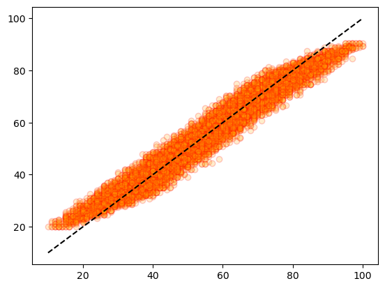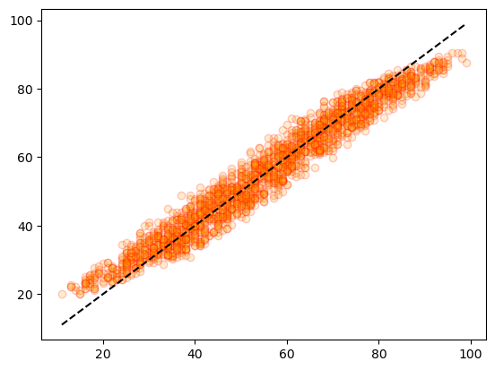

📌 Ridge 규제 적용 결과 (왼쪽: 학습 데이터, 오른쪽: 테스트 데이터)

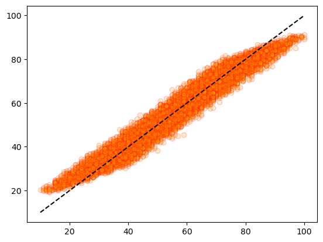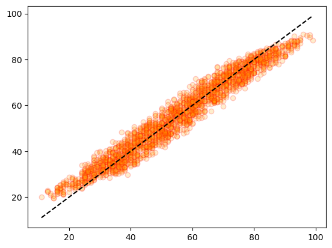
