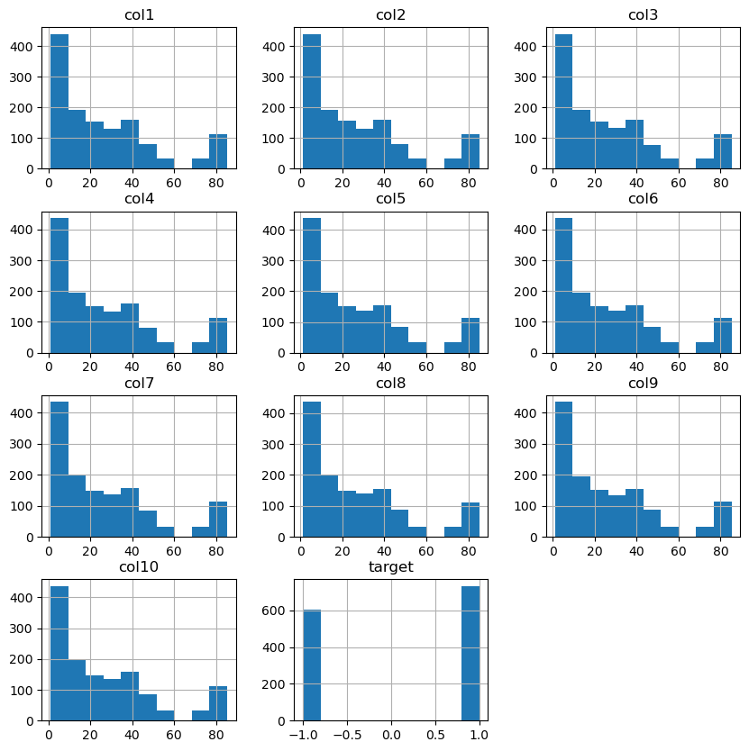

### 📌 용융 소자가 잠긴 액체의 종류 예측 (이중 분류)

#### 📚 Features

-   col1 ~ col10: 각 용융 소자가 측정한 전기 강도  
    \*강도 = ( |측정 전압 - 기본 전압| / 기본 전압 ) x 100,  
    기본 전압은 공기 중에서 측정한 전극의 전압을 나타냄

#### 🎈 Target

-   target: 물(1)/기름(-1)을 나타내는 정답 라벨

---

#### 📌 목차

1. 데이터 탐색 및 전처리
2. SMOTE를 통한 오버샘플링 진행
3. LDA를 통한 차원 축소 진행
4. Classifier 모델들을 사용한 분류 예측
5. 교차 검증을 통한 과적합 여부 확인
6. Threshold(임계값)에 따른 정밀도와 재현율 시각화
7. 정밀도와 재현율에 대한 분석

#### 1. 데이터 탐색 및 전처리

-   결측치가 존재하지 않았으며, 약 3137개의 중복행을 삭제했습니다.
-   데이터의 분포를 히스토그램으로 확인해보았습니다.

-   종속변수의 분포를 조정하기에 앞서, 각 독립변수의 분포를 보았을 때 대체로 동일한 양상을 띠어  
    `describe()`를 통해 수치로 확인해보았습니다.

-   모든 독립변수의 평균이나 표준편차 및 4분위 값이 완전히 동일한 값을 취하지는 않지만,  
    대체로 매우 비슷한 분포를 보이고 있습니다.
-   따라서 LDA를 통한 차원 축소를 진행하여도 무방하다고 판단하였습니다.
-   종속변수의 값이 -1과 1로 구성되어 있어 편의를 위해 0과 1로 레이블인코딩을 진행하였습니다.
-   기름이 0, 물이 1로 인코딩되었습니다.

#### 2. SMOTE를 통한 오버샘플링 진행

-   차원 축소를 진행하기에 앞서, 종속변수의 분포 비중을 맞추기 위해 SMOTE를 통한 오버샘플링을 진행했습니다.

#### 3. LDA를 통한 차원 축소 진행

-   종속 변수가 2개의 값 중 하나를 가지는 이진 분류에 해당하므로, 1차원으로 축소합니다.
-   10개의 feature를 1차원으로 축소하였음에도 불구하고, `explained_variance_ratio_`는 1.0이 나왔습니다.

#### 4. Classifier 모델들을 사용한 분류 예측

-   사용한 Classifier 모델들은 아래와 같습니다.
-   DecisionTreeClassifier(DTC)
-   SupportVector machine Classifier(SVC)
-   K-Nearest Neighbors classifier(KNN)
-   Ensemble(Hard/soft Voting[DTC, SVC, KNN])
-   Ensemble(Bagging[RandomForestClassifier(RFC)])
-   Ensemble(Boosting[AdaBoost, GradientBoosting machine Classifier(GBC), eXtra Gradient Boosting classifier(XGB), Light GradientBoostingMachine classifier(LGBM)])
-   위 모델들에 대해 GridSearchCV를 통해 최적의 하이퍼파라미터 탐색을 동시에 진행하였습니다.
-   LogisticRegression
-   각 모델별 평가 지표를 시각화한 그래프는 아래와 같았습니다.

-   각 모델별 평가 지표를 백분율로 나타낸 결과는 아래와 같습니다.

          DTC의 정확도: 96.2687%, 정밀도: 94.7712%, 재현율: 98.6395%, F1 Score: 96.6667%
          SVC의 정확도: 96.2687%, 정밀도: 94.7712%, 재현율: 98.6395%, F1 Score: 96.6667%
          KNN의 정확도: 96.6418%, 정밀도: 95.3947%, 재현율: 98.6395%, F1 Score: 96.99%
          RFC의 정확도: 96.6418%, 정밀도: 95.3947%, 재현율: 98.6395%, F1 Score: 96.99%
          Hard Voting의 정확도: 96.6418%, 정밀도: 95.3947%, 재현율: 98.6395%, F1 Score: 96.99%
          Soft Voting의 정확도: 96.6418%, 정밀도: 95.3947%, 재현율: 98.6395%, F1 Score: 96.99%
          AdaBoost의 정확도: 97.3881%, 정밀도: 95.4545%, 재현율: 100.0%, F1 Score: 97.6744%
          GBC의 정확도: 95.8955%, 정밀도: 93.5897%, 재현율: 99.3197%, F1 Score: 96.3696%
          XGBoost의 정확도: 96.2687%, 정밀도: 94.7712%, 재현율: 98.6395%, F1 Score: 96.6667%
          LightGBM의 정확도: 97.0149%, 정밀도: 95.4248%, 재현율: 99.3197%, F1 Score: 97.3333%
          LogisticRegression의 정확도: 97.3881%, 정밀도: 96.6667%, 재현율: 98.6395%, F1 Score: 97.6431%

-   F1 Score가 가장 높은 AdaBoost 모델과 LogisticRegression 모델 중, AdaBoost의 경우  
    재현율(Recall)이 1.0으로 과적합의 우려가 더 강하므로, LogisticRegression 모델이 가장 적합하다고 판단하였습니다.

#### 6. 교차 검증을 통한 과적합 여부 확인

-   `cross_val_score()`을 통해 훈련 데이터에서의 교차 검증 시 정확도와,  
    실제 테스트 데이터에 대한 예측 정확도를 비교해보았습니다.
-   교차 검증 시 평균 정확도는 약 0.9633, 테스트 데이터에 대한 정확도는 약 0.9739로 나타났습니다.
-   실제 예측 시의 정확도가 좀 더 높았으므로, 훈련 데이터에 대한 과적합은 발생하지 않았다고 판단됩니다.

#### 7. Threshold(임계치)에 따른 정밀도와 재현율 시각화

-   정밀도(precision)와 재현율(recall)의 trade-off를 시각화하였습니다.

-   threshold value가 약 0.6일 때를 기준으로 정밀도와 재현율이 서로 교차하고 있음을 알 수 있습니다.
-   이때의 ROC Curve 또한 시각화하였습니다.

-   ROC-AUC 값이 약 0.9725로 1에 매우 가깝기 때문에, ROC Curve 아래의 영역 또한 가로 1, 세로 1의  
    직사각형에 가까운 모습을 볼 수 있습니다.

#### 8. 정밀도와 재현율에 대한 분석

-   현재 주어진 이진 분류 상황에서 TP, FP, TN, FN과 정밀도 및 재현율이 나타내는 개념은 아래와 같습니다(0: 기름, 1: 물).
-   TP: 모델이 물에 잠긴 상황을 물에 잠긴 상황으로 올바르게 분류한 경우.
-   FP: 모델이 기름에 잠긴 상황을 물에 잠긴 상황으로 잘못 분류한 경우(오진, error I).
-   TN: 모델이 기름에 잠긴 상황을 기름에 잠긴 상황으로 올바르게 분류한 경우.
-   FN: 모델이 물에 잠긴 상황을 기름에 잠긴 상황으로 잘못 분류한 경우(놓침, error II).

-   정밀도 (Precision): 모델이 물에 잠긴 상황으로 예측한 상황 중에서 실제로 물에 잠긴 상황의 비율을 나타냅니다. 즉, 양성 클래스로 예측한 결과 중 얼마나 많은 것이 진짜 양성인지 측정합니다.
-   재현율 (Recall): 실제로 물에 잠긴 상황 중에서 모델이 물에 잠긴 상황으로 정확하게 예측한 상황의 비율을 나타냅니다. 즉, 모델이 얼마나 많은 물에 잠긴 상황을 "놓치지 않고" 감지했는지 측정합니다.

---

-   물과 기름 모두 전기가 자유롭게 흐르지 않지만, 전기적으로 비전도성인 물과 기름 간에는 차이가 있습니다. 일반적으로 물은 전기적으로 더 좋은 전도체로 간주됩니다. 물은 이온을 가지고 있으며 이온이 전기를 전달하는 데에 중요한 역할을 하기 때문입니다. 그러나 기름은 전기적으로 전도성이 낮습니다. 기름은 이온을 가지고 있지 않거나 매우 적기 때문에 전기를 전달하는 데에 물보다는 훨씬 더 낮은 능력을 가지고 있습니다.

-   따라서 전기 회로에서 물과 기름이 상호 작용할 때, 물은 전기를 더 잘 전달할 수 있으며, 이에 따라 더 많은 전기적 문제가 발생할 수 있습니다.
-   반면에 기름은 전기적으로 전도성이 낮기 때문에 전기 회로와의 상호 작용이 물보다는 덜할 수 있습니다.

-   이러한 이유로 물에 잠긴 상황이 전기 회로에 더 큰 위험을 가져올 수 있으므로, error II의 피해가 error I의 피해보다 크다는 결론을 내릴 수 있습니다.
-   즉, FN을 낮추기 위해 재현율을 높여야 합니다.
-   앞선 Logistic Regression 모델의 성능 평가 결과는 아래와 같았습니다.

**[정확도: 0.9739, 정밀도: 0.9667, 재현율: 0.9864, F1: 0.9764, ROC-AUC: 0.9725]**

-   앞서 임계치에 따른 정밀도와 재현율을 시각화한 그래프에서 볼 수 있듯이,  
    재현율을 높이기 위해 임계치를 낮출 경우 재현율의 상승폭보다 정밀도의 하락폭이 더 크며,  
     이미 재현율은 약 0.9864로 준수한 성능을 보이기 때문에 임계치 조정은 필요 없을 것으로 판단됩니다.
